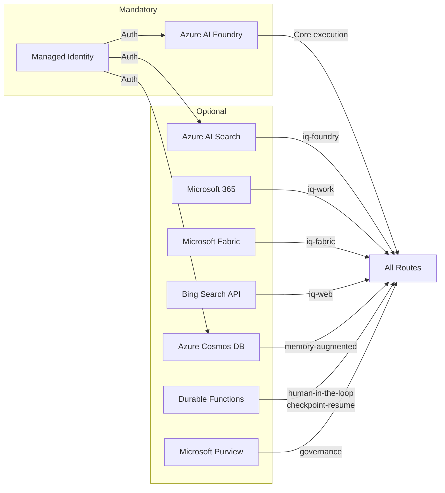

# Azure Requirements

## Mandatory Services

These services are required to run any SAFE Framework route.

| Service | SKU / Tier | Purpose |
|---|---|---|
| **Azure AI Foundry** (formerly Azure OpenAI) | Standard S0 | LLM execution for all agents |
| **Azure Managed Identity** | System or User Assigned | Authentication to all Azure services |
| **Azure Resource Group** | — | Resource container |

### Mandatory RBAC Roles

Assign to the Managed Identity used by the framework:

| Role | Scope | Reason |
|---|---|---|
| `Azure AI Developer` | AI Foundry resource | Deploy models, invoke completions |
| `Cognitive Services OpenAI User` | AI Foundry resource | Call chat-completions API |

```bash
# Example: assign Azure AI Developer to a system-assigned MI
OBJECT_ID=$(az webapp identity show --name <app> --resource-group <rg> --query principalId -o tsv)

az role assignment create \
  --assignee $OBJECT_ID \
  --role "Azure AI Developer" \
  --scope /subscriptions/<sub-id>/resourceGroups/<rg>/providers/Microsoft.CognitiveServices/accounts/<foundry-name>
```

---

## Optional Services by Feature

Each optional service unlocks specific patterns or agents.

### Foundry IQ (`iq-foundry`)

Enables the `iq-foundry` tool used by: `researcher`, `rag-query`, `semantic-search`, and all RAG pattern roles.

| Service | Notes |
|---|---|
| **Azure AI Search** | Standard S1+ recommended for production |
| **Azure Storage / SharePoint / OneLake** | Content sources indexed into AI Search |

| RBAC Role | Scope |
|---|---|
| `Search Index Data Reader` | AI Search resource |
| `Storage Blob Data Reader` | Storage accounts containing source documents |

---

### Work IQ (`iq-work`)

Enables the `iq-work` tool used by: `researcher`, `summarizer`, and M365-connected agents.

| Service | Notes |
|---|---|
| **Microsoft 365** | E3 or E5 license required per user |
| **Microsoft Graph API** | Delegated permissions for meetings, messages, documents |

| Graph Permission | Type | Reason |
|---|---|---|
| `Mail.Read` | Delegated | Email search |
| `Calendars.Read` | Delegated | Meeting context |
| `Files.Read.All` | Delegated | OneDrive/SharePoint documents |
| `Chat.Read` | Delegated | Teams chat signals |

---

### Fabric IQ (`iq-fabric`)

Enables the `iq-fabric` tool used by analytics and reporting agents.

| Service | Notes |
|---|---|
| **Microsoft Fabric** | F2 capacity minimum |
| **Power BI** | Premium Per User (PPU) or Premium Per Capacity |
| **OneLake** | Included with Fabric |

| RBAC Role | Scope |
|---|---|
| `Fabric Contributor` | Fabric workspace |
| `Power BI Dataset Reader` | Specific datasets |

---

### Web IQ (`iq-web`)

Enables the `iq-web` tool used by: `web-query`, `researcher` (external sources), RAG pattern retriever.

| Service | Notes |
|---|---|
| **Azure AI Search** (with Bing grounding) | Bing Search API key required |
| **Bing Search API** | S1 or S2 tier |

```bash
export BING_API_KEY="<your-bing-api-key>"
```

---

### Cosmos DB (`azure-cosmos-db`)

Required for: `memory-augmented` pattern, `rag-query` agent (vector similarity).

| Service | Notes |
|---|---|
| **Azure Cosmos DB NoSQL** | Serverless or provisioned throughput |
| Vector search feature | Enable in Cosmos DB account settings |

| RBAC Role | Scope |
|---|---|
| `Cosmos DB Built-in Data Contributor` | Cosmos DB account |

```bash
export COSMOS_ENDPOINT="https://<account>.documents.azure.com:443/"
# Or use Managed Identity (recommended — no key needed)
```

---

### Azure Durable Functions (`safe-durable-task`)

Required for: `human-in-the-loop` pattern (human gate suspend/resume), `checkpoint-resume` pattern.

| Service | Notes |
|---|---|
| **Azure Functions** | Consumption or Premium plan |
| **Durable Functions extension** | v2 |
| **Azure Storage** | Required by Durable Functions for state |

```bash
export DURABLE_TASK_ENDPOINT="https://<func-app>.azurewebsites.net/runtime/webhooks/durabletask"
export DURABLE_TASK_KEY="<system-key>"
```

---

### Microsoft Purview (optional — governance)

Used by the Purview security summary tool (see [Guide: Purview Tool](guides/08-purview-tool.md)).

| Service | Notes |
|---|---|
| **Microsoft Purview** | Standard or Premium |
| **Purview Data Map** | Required for lineage and classification |

| Role | Scope |
|---|---|
| `Purview Data Reader` | Purview account |

---

### Azure Monitor / Application Insights (recommended)

Used by the observability and health monitoring subsystem.

| Service | Notes |
|---|---|
| **Application Insights** | For agent traces and route telemetry |
| **Log Analytics Workspace** | Log storage and OTL analytics |

---

## Environment Variable Summary

```bash
# ── Core (Required) ────────────────────────────────────────────────
FOUNDRY_ENDPOINT="https://<workspace>.openai.azure.com/"
FOUNDRY_API_KEY="<api-key>"

# ── Durable Tasks (human-in-the-loop / checkpoint-resume) ──────────
DURABLE_TASK_ENDPOINT="https://<func-app>.azurewebsites.net/runtime/webhooks/durabletask"
DURABLE_TASK_KEY="<system-key>"

# ── Cosmos DB (memory-augmented / rag-query) ───────────────────────
COSMOS_ENDPOINT="https://<account>.documents.azure.com:443/"
COSMOS_KEY="<primary-key>"            # Skip if using Managed Identity

# ── Bing (web-query / iq-web) ─────────────────────────────────────
BING_API_KEY="<bing-api-key>"

# ── Managed Identity (production recommended) ──────────────────────
AZURE_CLIENT_ID="<mi-client-id>"
AZURE_TENANT_ID="<tenant-id>"
```

---

## Azure Resource Naming Conventions

SAFE Framework uses these environment variable conventions to locate resources. You do not need to follow these naming conventions for the Azure resources themselves.

| Component | Convention |
|---|---|
| Foundry workspace name | Any name; set in `FOUNDRY_ENDPOINT` |
| Cosmos DB database | `safe-memory` (default, configurable in `catalog.yaml`) |
| Cosmos DB container | `agent-memories` (default, configurable) |
| Durable Functions app | Any name; set in `DURABLE_TASK_ENDPOINT` |

---

## Feature → Azure Service Map


