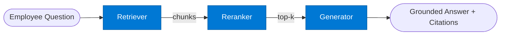

# Guide: Build a Simple Agent Workflow

This guide builds a **Policy Document Q&A** system using a single `rag` pattern — the right starting point for understanding SAFE Framework workflows.

**What we're building:** An agent that answers employee questions by retrieving relevant policy documents from SharePoint, reranking the results, and generating a grounded, cited answer.

**Pattern used:** `rag` (retriever → reranker → generator)
**Tools used:** `iq-foundry` (SharePoint/Blob index), `iq-web` (optional, for public regulation lookup)
**Estimated build time:** 15 minutes

---

## Architecture



---

## Prerequisites

- SAFE Framework installed (`pip install -e .`)
- `FOUNDRY_ENDPOINT` and `FOUNDRY_API_KEY` set
- Azure AI Search index with your policy documents (for `iq-foundry`)

---

## Step 1: Define the Route in Python

```python
# policy_qa_route.py
from safe_framework.safe_core.models import RouteDefinition, RoutePattern, Agent

policy_qa = RouteDefinition(
    name="policy-qa",
    pattern=RoutePattern.RAG,
    description="Answer employee policy questions with grounded citations",
    timeout_seconds=60,
    agents={
        "retriever": Agent(
            name="rag-retriever",
            category="retrieval",
            version="1.0",
            description="Retrieve relevant policy document chunks",
            input_schema={
                "type": "object",
                "properties": {"query": {"type": "string"}},
                "required": ["query"],
            },
            output_schema={
                "type": "object",
                "properties": {"chunks": {"type": "array"}, "sources": {"type": "array"}},
                "required": ["chunks"],
            },
        ),
        "reranker": Agent(
            name="rag-reranker",
            category="retrieval",
            version="1.0",
            description="Rerank chunks by relevance to query",
            input_schema={
                "type": "object",
                "properties": {
                    "query": {"type": "string"},
                    "chunks": {"type": "array"},
                },
                "required": ["query", "chunks"],
            },
            output_schema={
                "type": "object",
                "properties": {"top_chunks": {"type": "array"}},
                "required": ["top_chunks"],
            },
        ),
        "generator": Agent(
            name="rag-generator",
            category="generation",
            version="1.0",
            description="Generate grounded answer with citations",
            input_schema={
                "type": "object",
                "properties": {
                    "query": {"type": "string"},
                    "context": {"type": "array"},
                },
                "required": ["query", "context"],
            },
            output_schema={
                "type": "object",
                "properties": {
                    "answer": {"type": "string"},
                    "citations": {"type": "array"},
                },
                "required": ["answer"],
            },
        ),
    },
)
```

---

## Step 2: Generate the Route Code

```python
from safe_framework.safe_core.code_generator import RouteCodeGenerator

generator = RouteCodeGenerator()
generated = generator.generate(policy_qa)

# Save to disk
generated.save_to_disk("routes/policy-qa")
```

This creates:

```
routes/policy-qa/
├── route.py            Generated Python route class
├── requirements.txt    pip dependencies
├── config.yaml         Route configuration
└── test_data.json      Sample test payloads
```

---

## Step 3: Inspect the Generated Route

The generated `route.py` looks like this (abbreviated):

```python
class PolicyQaRoute:
    """policy-qa — Answer employee policy questions with grounded citations"""

    def __init__(self, kernel: Kernel):
        self.kernel = kernel
        self.retriever = None   # wire to rag-retriever agent
        self.reranker = None    # wire to rag-reranker agent
        self.generator = None   # wire to rag-generator agent

    async def invoke(self, request: dict) -> dict:
        # Step 1: Retrieve relevant chunks from iq-foundry
        retrieval_result = await self.retriever.invoke({
            "query": request["query"]
        })

        # Step 2: Rerank chunks by relevance
        rerank_result = await self.reranker.invoke({
            "query": request["query"],
            "chunks": retrieval_result["chunks"],
        })

        # Step 3: Generate grounded answer
        final_result = await self.generator.invoke({
            "query": request["query"],
            "context": rerank_result["top_chunks"],
        })

        return {
            "answer": final_result["answer"],
            "citations": final_result.get("citations", []),
            "sources": retrieval_result.get("sources", []),
        }
```

---

## Step 4: Wire the `iq-foundry` Tool

The retriever agent uses the `iq-foundry` tool to query your Azure AI Search index. Configure this in the retriever's `agent.yaml`:

```yaml
# routes/policy-qa/retriever/agent.yaml  (or use the pattern template)
tools:
  - id: iq-foundry
    purpose: "Search SharePoint policy document index"
    config:
      index_name: "policy-documents"
      top_k: 10
      semantic_config: "policy-semantic-config"
```

The `iq-foundry` tool authenticates using **Managed Identity** — no key required in production.

For local development:

```bash
export FOUNDRY_ENDPOINT="https://<workspace>.openai.azure.com/"
export FOUNDRY_API_KEY="<key>"
```

---

## Step 5: Run the Route

```python
import asyncio
from semantic_kernel import Kernel

async def main():
    kernel = Kernel()
    # ... configure kernel with Azure OpenAI ...

    route = PolicyQaRoute(kernel=kernel)

    result = await route.invoke({
        "query": "What is the policy for remote work expense reimbursement?"
    })

    print(result["answer"])
    for citation in result["citations"]:
        print(f"  - {citation}")

asyncio.run(main())
```

---

## Step 6: Validate Before Deployment

```python
from safe_framework.safe_core.validator import RouteValidator

validator = RouteValidator()
errors = validator.validate(policy_qa)

if errors:
    for e in errors:
        print(f"[{e.error_type}] {e.message}")
        for suggestion in e.suggested_solutions:
            print(f"  → {suggestion}")
else:
    print("Route is valid — ready to deploy.")
```

---

## Using the CLI Instead

If you prefer the interactive flow, the CLI does all of the above:

```bash
safe route
# Pattern: rag
# Route name: policy-qa
# Retriever agent: rag-query  (from standalone catalog)
# Reranker agent: semantic-search
# Generator agent: document-writer
```

---

## What's Next

- Add caching to the retriever — wrap with `memory-augmented` pattern to avoid re-fetching identical queries
- Add a quality gate — wrap with `evaluator-optimizer` to score answer quality before returning
- See [Guide: Business Workflow](02-business-workflow.md) for a 3-pattern example
