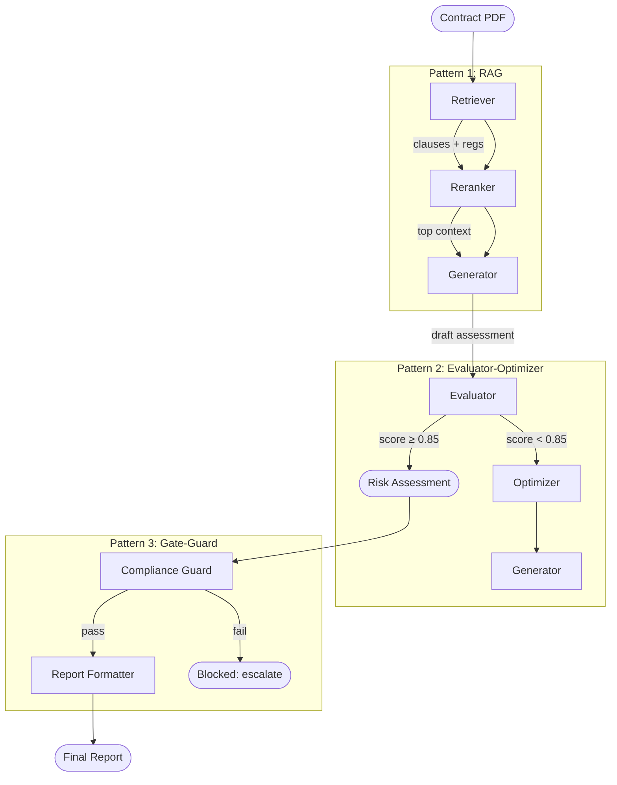

# Guide: Business Workflow (2–3 Patterns)

This guide builds a **Contract Review Automation** system — a realistic CSA use case that combines three patterns to review supplier contracts for risk and compliance.

**What we're building:** A workflow that retrieves relevant contract clauses, iteratively refines a risk assessment until quality threshold is met, then runs a final compliance gate before delivering the report.

**Patterns used:**
1. `rag` — Retrieve relevant contract clauses and regulations
2. `evaluator-optimizer` — Iterate on the risk assessment until score ≥ 0.85
3. `gate-guard` — Final compliance check before report delivery

**Tools used:** `iq-foundry` (contract index), `iq-web` (public regulations), `iq-work` (related emails/meetings)
**Estimated build time:** 30 minutes

---

## Architecture



---

## Prerequisites

- SAFE Framework installed
- Azure AI Search index with contracts and clauses (`iq-foundry`)
- `FOUNDRY_ENDPOINT` and `FOUNDRY_API_KEY` set

---

## Step 1: Define a Composite Route

Composite routes chain multiple patterns. Each pattern's output feeds the next.

```python
# contract_review/route.py
import asyncio
from datetime import datetime
from typing import Any, Dict
import logging
from semantic_kernel import Kernel

logger = logging.getLogger(__name__)

class ContractReviewRoute:
    """
    contract-review — End-to-end contract risk assessment and compliance check.
    Chains: RAG → evaluator-optimizer → gate-guard
    """

    MAX_EVAL_ITERATIONS = 4
    QUALITY_THRESHOLD = 0.85

    def __init__(self, kernel: Kernel):
        self.kernel = kernel
        # RAG pattern agents
        self.retriever = None
        self.reranker = None
        self.rag_generator = None
        # Evaluator-optimizer agents
        self.evaluator = None
        self.optimizer = None
        # Gate-guard agents
        self.guard = None
        self.report_formatter = None

    async def invoke(self, request: Dict[str, Any]) -> Dict[str, Any]:
        start_time = datetime.now()
        contract_text = request["contract_text"]
        contract_id = request.get("contract_id", "unknown")

        # ── Pattern 1: RAG ────────────────────────────────────────────
        logger.info(f"[{contract_id}] RAG: retrieving relevant clauses and regulations")

        retrieval = await self.retriever.invoke({
            "query": f"contract clauses risk compliance {contract_text[:500]}",
        })

        reranked = await self.reranker.invoke({
            "query": contract_text[:500],
            "chunks": retrieval["chunks"],
        })

        draft_assessment = await self.rag_generator.invoke({
            "contract_text": contract_text,
            "context": reranked["top_chunks"],
        })

        # ── Pattern 2: Evaluator-Optimizer ────────────────────────────
        logger.info(f"[{contract_id}] Evaluator-Optimizer: iterating to quality threshold")

        assessment = draft_assessment["assessment"]
        feedback = None

        for iteration in range(self.MAX_EVAL_ITERATIONS):
            eval_result = await self.evaluator.invoke({
                "contract_text": contract_text,
                "assessment": assessment,
                "context": reranked["top_chunks"],
            })

            score = eval_result["quality_score"]
            logger.info(f"[{contract_id}] Iteration {iteration + 1}: score={score:.2f}")

            if score >= self.QUALITY_THRESHOLD:
                break

            # Optimize: regenerate with feedback
            feedback = eval_result["feedback"]
            optimized = await self.optimizer.invoke({
                "assessment": assessment,
                "feedback": feedback,
            })
            assessment = optimized["improved_assessment"]
        else:
            logger.warning(f"[{contract_id}] Quality threshold not reached after {self.MAX_EVAL_ITERATIONS} iterations")

        # ── Pattern 3: Gate-Guard ─────────────────────────────────────
        logger.info(f"[{contract_id}] Gate-Guard: compliance check")

        guard_result = await self.guard.invoke({
            "assessment": assessment,
            "contract_id": contract_id,
            "quality_score": score,
        })

        if not guard_result["passed"]:
            return {
                "status": "blocked",
                "reason": guard_result["reason"],
                "contract_id": contract_id,
                "escalate_to": guard_result.get("escalate_to", "legal-team"),
            }

        # Format final report
        report = await self.report_formatter.invoke({
            "assessment": assessment,
            "contract_id": contract_id,
            "context_sources": retrieval.get("sources", []),
            "quality_score": score,
        })

        return {
            "status": "approved",
            "contract_id": contract_id,
            "report": report["formatted_report"],
            "risk_level": report["risk_level"],
            "recommendations": report.get("recommendations", []),
            "duration_seconds": (datetime.now() - start_time).total_seconds(),
        }
```

---

## Step 2: Configure the Agents

Each agent in the route needs an `agent.yaml` with its contract and tools:

```yaml
# contract_review/retriever/agent.yaml
name: Contract Clause Retriever
version: 1.0
category: retrieval
description: |
  Retrieves relevant contract clauses, legal definitions, and regulations
  from indexed sources.

contract:
  inputs:
    - name: query
      type: string
      required: true
      description: Search query derived from contract content

  outputs:
    - name: chunks
      type: array
      required: true
      description: Retrieved document chunks
    - name: sources
      type: array
      required: false
      description: Source document metadata

tools:
  - id: iq-foundry
    purpose: "Search contract clause and legal document index"
  - id: iq-web
    purpose: "Search public regulations and legal updates"
```

```yaml
# contract_review/guard/agent.yaml
name: Compliance Guard
version: 1.0
category: governance
description: |
  Validates contract risk assessments against mandatory compliance policies
  before delivery. Blocks high-risk or incomplete assessments.

contract:
  inputs:
    - name: assessment
      type: string
      required: true
    - name: quality_score
      type: number
      required: true
    - name: contract_id
      type: string
      required: true

  outputs:
    - name: passed
      type: boolean
      required: true
    - name: reason
      type: string
      required: false
    - name: escalate_to
      type: string
      required: false

tools: []
```

---

## Step 3: Run the Workflow

```python
import asyncio
from semantic_kernel import Kernel
from semantic_kernel.connectors.ai.open_ai import AzureChatCompletion

async def main():
    kernel = Kernel()
    kernel.add_service(AzureChatCompletion(
        service_id="gpt4o",
        endpoint=os.environ["FOUNDRY_ENDPOINT"],
        api_key=os.environ["FOUNDRY_API_KEY"],
        deployment_name="gpt-4o",
    ))

    route = ContractReviewRoute(kernel=kernel)
    # Wire agents ... (see full implementation in routes/contract-review/)

    with open("supplier-agreement.pdf", "rb") as f:
        contract_text = extract_text(f)  # your PDF extraction logic

    result = await route.invoke({
        "contract_id": "SUPP-2026-0042",
        "contract_text": contract_text,
    })

    if result["status"] == "approved":
        print(f"Risk level: {result['risk_level']}")
        print(result["report"])
    else:
        print(f"BLOCKED: {result['reason']}")
        print(f"Escalate to: {result['escalate_to']}")

asyncio.run(main())
```

---

## Step 4: Tune the Quality Threshold

The evaluator-optimizer quality threshold is a key parameter. Start with 0.8 and adjust:

| Threshold | Trade-off |
|---|---|
| 0.70 | Fast (1–2 iterations), acceptable quality |
| 0.85 | Balanced (2–3 iterations), good quality — **recommended** |
| 0.95 | High quality (3–4 iterations), slower, may not always reach threshold |

Set `MAX_EVAL_ITERATIONS = 4` as a safety cap. If the threshold is not reached in time, the best-so-far assessment proceeds with a warning logged.

---

## Step 5: Add Cost Controls

This workflow calls the LLM 6–12 times per contract. Use `safe-token-metrics` to track costs:

```python
# Add token tracking to any agent invoke
from safe_framework.tools.mcp.token_metrics_mcp import token_metrics_get_cost

cost = await token_metrics_get_cost(request_id=contract_id)
logger.info(f"[{contract_id}] Total cost: ${cost['total_usd']:.4f}")
```

Or use the `budget-aware-routing` pattern in place of the evaluator to route each iteration to the cheapest model that meets quality requirements.

---

## What's Next

- Add persistence: wrap with `checkpoint-resume` so long contracts survive process restarts
- Add human approval: insert `human-in-the-loop` between the gate-guard and the final report for contracts above a risk threshold
- See [Guide: Complex Workflow](03-complex-workflow.md) for a 5-6 pattern enterprise solution
