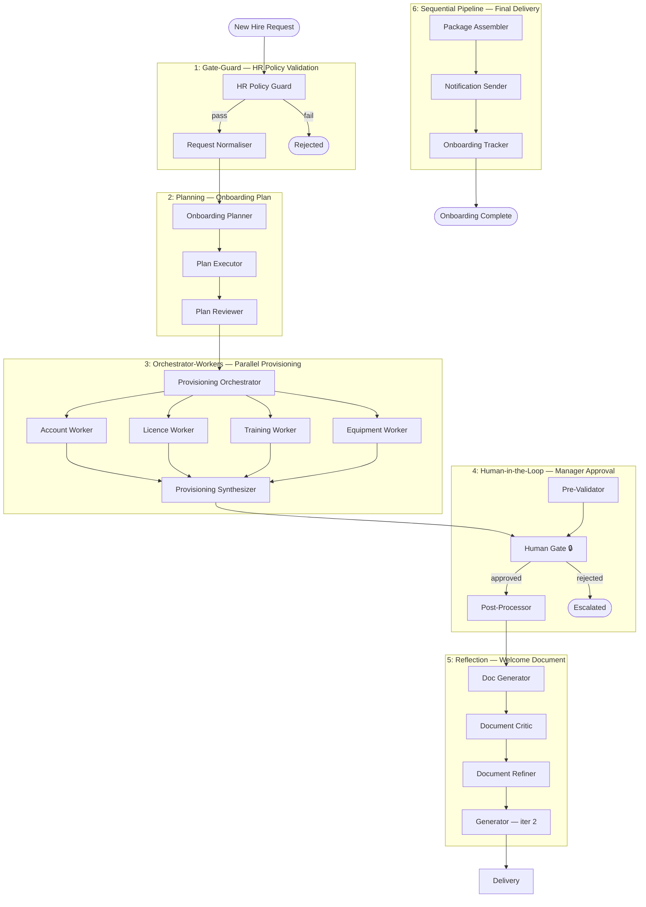

# Guide: Complex Business Workflow (5–6 Patterns)

This guide builds an **Employee Onboarding Automation** system — a complex enterprise workflow that uses six patterns, a human approval gate, and three customised standalone agents.

**What we're building:** An end-to-end onboarding workflow that validates the request, creates a personalised onboarding plan, runs parallel provisioning tasks, requires manager approval for sensitive access, refines the welcome documentation, and delivers a complete onboarding package.

**Patterns used:**
1. `gate-guard` — Validate the onboarding request against HR policy
2. `planning` — Create a personalised onboarding plan
3. `orchestrator-workers` — Parallel provisioning (accounts, licences, training, equipment)
4. `human-in-the-loop` — Manager approval for privileged access requests
5. `reflection` — Refine the welcome document through self-critique
6. `sequential-pipeline` — Final assembly and delivery of the onboarding package

**Standalone agents customised for this task:**
- `researcher` (customised) — Find role-specific training resources
- `document-writer` (customised) — Create the personalised welcome document
- `summarizer` (customised) — Generate briefing summaries for the new hire's first week

**Tools used:** `iq-foundry`, `iq-work`, `safe-durable-task`, `azure-cosmos-db`

---

## Architecture



---

## Prerequisites

- SAFE Framework installed
- `FOUNDRY_ENDPOINT`, `FOUNDRY_API_KEY`, `DURABLE_TASK_ENDPOINT`, `DURABLE_TASK_KEY` set
- Azure Durable Functions deployed (for human-in-the-loop suspension)
- Azure Cosmos DB (for memory and state across provisioning workers)

---

## Step 1: Customise the Standalone Agents

The three standalone agents are used directly in this workflow. Each is customised with a project-specific system prompt and tool configuration.

### 1a: Customise the `researcher` Agent for Training Discovery

Fork the researcher agent for this project:

```bash
safe tool fork iq-foundry onboarding-workflow
safe tool fork iq-work onboarding-workflow
```

Create a project-specific researcher configuration:

```yaml
# routes/onboarding/researcher/agent.yaml
name: Training Resource Researcher
version: 1.0
category: research
description: |
  Finds role-specific training resources, certifications, and learning paths
  for new hires. Searches internal training catalogues and external providers.

contract:
  inputs:
    - name: job_title
      type: string
      required: true
    - name: department
      type: string
      required: true
    - name: skills_required
      type: array
      required: false

  outputs:
    - name: training_resources
      type: array
      required: true
      description: Ordered list of recommended training resources
    - name: certifications
      type: array
      required: false
      description: Relevant certifications to pursue

tools:
  - id: iq-foundry
    purpose: "Search internal training catalogue and learning paths"
  - id: iq-web
    purpose: "Find external certifications and public training resources"

metadata:
  system_prompt: |
    You are a Learning & Development specialist. Find the most relevant
    training resources for a new {job_title} joining the {department} team.
    Prioritise internal resources first, then certified external providers.
    Return resources ordered by priority (mandatory first, then recommended).
```

### 1b: Customise the `document-writer` Agent for Welcome Documents

```yaml
# routes/onboarding/document-writer/agent.yaml
name: Welcome Document Writer
version: 1.0
category: content
description: |
  Creates personalised welcome documents for new hires including
  first-week schedule, team introduction, key contacts, and role overview.

contract:
  inputs:
    - name: new_hire_name
      type: string
      required: true
    - name: job_title
      type: string
      required: true
    - name: department
      type: string
      required: true
    - name: manager_name
      type: string
      required: true
    - name: onboarding_plan
      type: object
      required: true
    - name: training_resources
      type: array
      required: true

  outputs:
    - name: welcome_document
      type: string
      required: true
      description: Formatted Markdown welcome document
    - name: first_week_schedule
      type: object
      required: true

tools:
  - id: iq-work
    purpose: "Retrieve team org chart, manager calendar, and team profiles"

metadata:
  system_prompt: |
    You are an HR communications specialist. Create a warm, professional
    welcome document for {new_hire_name} joining as {job_title}.
    Use a friendly but professional tone. Include specific, actionable
    first steps and make the new hire feel genuinely welcomed.
    Format as clean Markdown with clear sections.
```

### 1c: Customise the `summarizer` Agent for First-Week Briefings

```yaml
# routes/onboarding/summarizer/agent.yaml
name: First-Week Briefing Summarizer
version: 1.0
category: content
description: |
  Generates concise briefing summaries from team documents, recent meeting
  notes, and project context to help new hires get up to speed quickly.

contract:
  inputs:
    - name: department
      type: string
      required: true
    - name: team_documents
      type: array
      required: true
    - name: recent_meetings
      type: array
      required: false

  outputs:
    - name: briefing_summary
      type: string
      required: true
    - name: key_priorities
      type: array
      required: true
    - name: people_to_meet
      type: array
      required: false

tools:
  - id: iq-work
    purpose: "Retrieve recent team meetings, decisions, and shared documents"
  - id: iq-foundry
    purpose: "Search team wikis and internal knowledge base"
```

---

## Step 2: Build the Composite Route

```python
# routes/onboarding/route.py
import asyncio
from datetime import datetime
from typing import Any, Dict, List
import logging
from semantic_kernel import Kernel

logger = logging.getLogger(__name__)


class EmployeeOnboardingRoute:
    """
    employee-onboarding — End-to-end onboarding automation.
    Chains: gate-guard → planning → orchestrator-workers →
            human-in-the-loop → reflection → sequential-pipeline
    """

    REFLECTION_ITERATIONS = 2
    PROVISIONING_TASKS = ["accounts", "licences", "training", "equipment"]

    def __init__(self, kernel: Kernel):
        self.kernel = kernel
        # 1. Gate-Guard
        self.hr_guard = None
        self.request_normaliser = None
        # 2. Planning
        self.planner = None
        self.plan_executor = None
        self.plan_reviewer = None
        # 3. Orchestrator-Workers
        self.orchestrator = None
        self.provisioning_workers: Dict[str, Any] = {}  # task_name → worker agent
        self.synthesizer = None
        # 4. Human-in-the-Loop
        self.pre_validator = None
        self.human_gate = None
        self.post_processor = None
        # 5. Reflection
        self.doc_generator = None
        self.doc_critic = None
        self.doc_refiner = None
        # 6. Sequential Pipeline — standalone agents
        self.researcher = None        # customised standalone
        self.document_writer = None   # customised standalone
        self.summarizer = None        # customised standalone
        self.notifier = None
        self.tracker = None

    async def invoke(self, request: Dict[str, Any]) -> Dict[str, Any]:
        start = datetime.now()
        employee_id = request.get("employee_id", "unknown")
        logger.info(f"[{employee_id}] Starting onboarding workflow")

        # ── 1. Gate-Guard: HR Policy Validation ──────────────────────
        logger.info(f"[{employee_id}] Gate-Guard: validating request")
        guard_result = await self.hr_guard.invoke({
            "employee_id": employee_id,
            "job_title": request["job_title"],
            "department": request["department"],
            "start_date": request["start_date"],
            "access_level": request.get("access_level", "standard"),
        })

        if not guard_result["passed"]:
            logger.warning(f"[{employee_id}] Request rejected: {guard_result['reason']}")
            return {
                "status": "rejected",
                "reason": guard_result["reason"],
                "employee_id": employee_id,
            }

        normalised = await self.request_normaliser.invoke({
            "raw_request": request,
            "validation_metadata": guard_result,
        })
        norm = normalised["normalised_request"]

        # ── 2. Planning: Onboarding Plan ─────────────────────────────
        logger.info(f"[{employee_id}] Planning: creating onboarding plan")
        plan = await self.planner.invoke({
            "job_title": norm["job_title"],
            "department": norm["department"],
            "start_date": norm["start_date"],
            "manager_id": norm.get("manager_id"),
        })

        executed_plan = await self.plan_executor.invoke({
            "plan": plan["onboarding_plan"],
            "employee_id": employee_id,
        })

        reviewed_plan = await self.plan_reviewer.invoke({
            "plan": plan["onboarding_plan"],
            "execution_result": executed_plan,
        })

        # ── 3. Orchestrator-Workers: Parallel Provisioning ────────────
        logger.info(f"[{employee_id}] Orchestrator-Workers: parallel provisioning")
        task_assignments = await self.orchestrator.invoke({
            "employee_id": employee_id,
            "onboarding_plan": reviewed_plan["finalised_plan"],
            "access_level": norm.get("access_level", "standard"),
        })

        # Run provisioning workers in parallel
        worker_tasks = []
        for task in self.PROVISIONING_TASKS:
            if task in task_assignments["tasks"]:
                worker = self.provisioning_workers.get(task)
                if worker:
                    worker_tasks.append(worker.invoke({
                        "employee_id": employee_id,
                        "task_spec": task_assignments["tasks"][task],
                    }))

        worker_results = await asyncio.gather(*worker_tasks, return_exceptions=True)

        provisioning_summary = await self.synthesizer.invoke({
            "employee_id": employee_id,
            "worker_results": [
                r for r in worker_results if not isinstance(r, Exception)
            ],
            "errors": [
                str(r) for r in worker_results if isinstance(r, Exception)
            ],
        })

        # ── 4. Human-in-the-Loop: Manager Approval ───────────────────
        # Required for privileged access (admin, finance, security roles)
        if norm.get("access_level") in ("admin", "privileged", "finance"):
            logger.info(f"[{employee_id}] Human-in-the-Loop: requesting manager approval")

            pre_val = await self.pre_validator.invoke({
                "employee_id": employee_id,
                "access_requests": provisioning_summary["privileged_access_requests"],
                "manager_id": norm.get("manager_id"),
            })

            # This suspends the workflow and sends an approval email
            # Resumes when manager clicks Approve/Reject in the notification
            approval = await self.human_gate.invoke({
                "approval_request": pre_val["approval_package"],
                "timeout_hours": 48,
                "escalate_to": norm.get("hr_partner"),
            })

            if approval["decision"] != "approved":
                return {
                    "status": "access_rejected",
                    "reason": approval.get("rejection_reason"),
                    "employee_id": employee_id,
                    "provisioning_partial": provisioning_summary["standard_access_complete"],
                }

            provisioning_summary = await self.post_processor.invoke({
                "provisioning_summary": provisioning_summary,
                "approval_record": approval,
            })

        # ── 5. Reflection: Welcome Document ──────────────────────────
        logger.info(f"[{employee_id}] Reflection: generating welcome document")

        # First, gather training resources via customised researcher
        training = await self.researcher.invoke({
            "job_title": norm["job_title"],
            "department": norm["department"],
        })

        # Generate → critique → refine (N iterations)
        doc = await self.doc_generator.invoke({
            "new_hire_name": norm["full_name"],
            "job_title": norm["job_title"],
            "department": norm["department"],
            "manager_name": norm.get("manager_name"),
            "onboarding_plan": reviewed_plan["finalised_plan"],
            "training_resources": training["training_resources"],
        })

        for i in range(self.REFLECTION_ITERATIONS):
            critique = await self.doc_critic.invoke({
                "document": doc["welcome_document"],
                "new_hire_context": norm,
            })
            if critique["is_acceptable"]:
                break
            refined = await self.doc_refiner.invoke({
                "document": doc["welcome_document"],
                "critique": critique["feedback"],
            })
            doc = {"welcome_document": refined["refined_document"]}

        # ── 6. Sequential Pipeline: Final Delivery ───────────────────
        logger.info(f"[{employee_id}] Sequential: assembling and delivering package")

        # Summarize first-week context
        briefing = await self.summarizer.invoke({
            "department": norm["department"],
            "team_documents": [],  # populated from iq-work in production
        })

        # Assemble the complete onboarding package
        package = {
            "employee_id": employee_id,
            "welcome_document": doc["welcome_document"],
            "first_week_briefing": briefing["briefing_summary"],
            "training_resources": training["training_resources"],
            "provisioning_status": provisioning_summary,
            "key_priorities": briefing["key_priorities"],
        }

        # Send notification to new hire, manager, and IT
        await self.notifier.invoke({
            "package": package,
            "recipients": {
                "new_hire": norm["email"],
                "manager": norm.get("manager_email"),
                "it_support": "it-support@company.com",
            },
        })

        # Record completion in tracker
        tracking = await self.tracker.invoke({
            "employee_id": employee_id,
            "package": package,
            "completed_at": datetime.now().isoformat(),
            "duration_seconds": (datetime.now() - start).total_seconds(),
        })

        return {
            "status": "completed",
            "employee_id": employee_id,
            "tracking_id": tracking["tracking_id"],
            "duration_seconds": (datetime.now() - start).total_seconds(),
            "package_summary": {
                "welcome_document_length": len(doc["welcome_document"]),
                "training_resources_count": len(training["training_resources"]),
                "provisioning_tasks_completed": provisioning_summary.get("tasks_completed", 0),
            },
        }
```

---

## Step 3: Configure the Durable Human Gate

The `human-in-the-loop` pattern uses `safe-durable-task` to suspend the workflow:

```yaml
# .env or Azure App Configuration
DURABLE_TASK_ENDPOINT=https://onboarding-functions.azurewebsites.net/runtime/webhooks/durabletask
DURABLE_TASK_KEY=<system-key>
```

When the human gate invokes `durable_suspend()`, the workflow pauses and an approval notification is sent (via Logic Apps or Power Automate). When the manager approves/rejects via the adaptive card, `durable_resume()` is called and the workflow continues.

The approval card is configured in `routes/onboarding/human_gate/approval_card.json`.

---

## Step 4: Cost Estimate

| Step | Pattern | LLM Calls | Est. Cost per Run |
|---|---|---|---|
| HR validation | gate-guard | 1–2 | $0.01 |
| Planning | planning | 3 | $0.05 |
| Provisioning | orchestrator-workers | 5–8 | $0.10 |
| Human gate | human-in-the-loop | 1 | $0.01 |
| Document reflection | reflection | 4–6 | $0.12 |
| Final delivery | sequential-pipeline | 3 | $0.04 |
| **Total** | | **~17–22 calls** | **~$0.33** |

Use `safe-token-metrics` to track actual costs per employee and `budget-aware-routing` to substitute cheaper models for lower-stakes steps (provisioning planning vs. welcome document generation).

---

## Step 5: Test the Workflow

```python
import asyncio

async def test_onboarding():
    route = EmployeeOnboardingRoute(kernel=kernel)
    # wire agents ...

    result = await route.invoke({
        "employee_id": "E-2026-0099",
        "full_name": "Jordan Smith",
        "email": "jordan.smith@company.com",
        "job_title": "Senior Cloud Solution Architect",
        "department": "Azure Customer Success",
        "start_date": "2026-07-14",
        "manager_id": "M-0042",
        "manager_email": "manager@company.com",
        "access_level": "privileged",
    })

    print(f"Status: {result['status']}")
    print(f"Duration: {result['duration_seconds']:.1f}s")
    if result["status"] == "completed":
        print(f"Tracking ID: {result['tracking_id']}")

asyncio.run(test_onboarding())
```

---

## Extending This Workflow

| Extension | Pattern to Add | Benefit |
|---|---|---|
| Retry failed provisioning tasks | `retry-loop` | Automatically retry transient failures |
| Cost-optimise LLM calls | `budget-aware-routing` | Reduce LLM spend by 40–60% |
| Ensure consistent policy answers | `self-consistency` | Run planner N times, vote on best plan |
| Durable long onboarding | `checkpoint-resume` | Resume if workflow crashes mid-run |
| Vendor access review | `debate` | Proposer requests access, challenger reviews risks |
