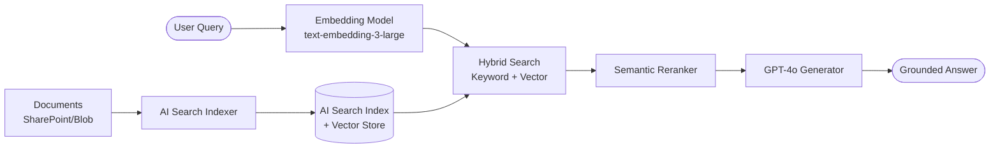

# Guide: Models, RAG, and Governance

This guide covers deploying and managing models in Azure AI Foundry, setting up retrieval-augmented generation (RAG) with Azure AI Search, and using the SAFE Framework governance layer for approval workflows and policy enforcement.

---

## Part 1: Deploying Models

### Supported Models

SAFE Framework routes work with any Azure AI Foundry deployment. Recommended models by use case:

| Use Case | Recommended Model | Notes |
|---|---|---|
| General reasoning, complex routes | `gpt-4o` | Best quality; use for evaluator, judge, planner roles |
| Cost-efficient generation | `gpt-4o-mini` | 10–20× cheaper; good for generation, summarisation |
| Embeddings (RAG) | `text-embedding-3-large` | Best semantic accuracy |
| Embeddings (cost-efficient) | `text-embedding-3-small` | Good accuracy, lower cost |
| Long-context documents | `gpt-4o` (128k) | For contracts, large reports |
| Code generation | `gpt-4o` | Best for code-related agents |

### Deploying a Model via Azure CLI

```bash
# Deploy GPT-4o
az cognitiveservices account deployment create \
  --resource-group <rg> \
  --name <foundry-workspace> \
  --deployment-name gpt-4o \
  --model-name gpt-4o \
  --model-version 2024-11-20 \
  --model-format OpenAI \
  --sku-name Standard \
  --sku-capacity 100    # Tokens per minute (thousands)

# Deploy text-embedding-3-large for RAG
az cognitiveservices account deployment create \
  --resource-group <rg> \
  --name <foundry-workspace> \
  --deployment-name text-embedding-3-large \
  --model-name text-embedding-3-large \
  --model-version 1 \
  --model-format OpenAI \
  --sku-name Standard \
  --sku-capacity 50
```

### Registering Models in the SAFE Framework

Update `safe_core/catalog.yaml` to list available model deployments:

```yaml
# safe_framework/safe_core/catalog.yaml
models:
  - deployment_name: gpt-4o
    model: gpt-4o
    version: 2024-11-20
    policy_tags: ["quality", "balanced"]
    max_tokens: 128000
    cost_per_1k_input_tokens: 0.005
    cost_per_1k_output_tokens: 0.015

  - deployment_name: gpt-4o-mini
    model: gpt-4o-mini
    version: 2024-07-18
    policy_tags: ["cost", "balanced", "speed"]
    max_tokens: 128000
    cost_per_1k_input_tokens: 0.00015
    cost_per_1k_output_tokens: 0.0006
```

The `safe-model-router` MCP uses these cost entries to select the cheapest model satisfying the quality policy.

### Using Multiple Models in a Route

```python
from semantic_kernel import Kernel
from semantic_kernel.connectors.ai.open_ai import AzureChatCompletion

kernel = Kernel()

# Register both models as named services
kernel.add_service(AzureChatCompletion(
    service_id="gpt4o",
    deployment_name="gpt-4o",
    endpoint=os.environ["FOUNDRY_ENDPOINT"],
    api_key=os.environ["FOUNDRY_API_KEY"],
))

kernel.add_service(AzureChatCompletion(
    service_id="gpt4o-mini",
    deployment_name="gpt-4o-mini",
    endpoint=os.environ["FOUNDRY_ENDPOINT"],
    api_key=os.environ["FOUNDRY_API_KEY"],
))

# Agents can then specify which model to use
# High-value agents (judge, evaluator) → gpt4o
# High-volume agents (generator, summarizer) → gpt4o-mini
```

---

## Part 2: Setting Up RAG

### Architecture



### Step 1: Create an AI Search Index

```bash
# Create the AI Search service
az search service create \
  --resource-group <rg> \
  --name <search-service-name> \
  --sku Standard \
  --partition-count 1 \
  --replica-count 1

# Create an index (via Azure Portal or REST API)
# The index needs: content field, content_vector field, metadata fields
```

**Example index schema (REST):**

```json
{
  "name": "enterprise-docs",
  "fields": [
    {"name": "id", "type": "Edm.String", "key": true},
    {"name": "content", "type": "Edm.String", "searchable": true},
    {"name": "content_vector", "type": "Collection(Edm.Single)",
     "searchable": true, "dimensions": 3072,
     "vectorSearchProfile": "hnsw-profile"},
    {"name": "title", "type": "Edm.String", "searchable": true, "filterable": true},
    {"name": "source", "type": "Edm.String", "filterable": true, "retrievable": true},
    {"name": "last_modified", "type": "Edm.DateTimeOffset", "filterable": true}
  ],
  "vectorSearch": {
    "algorithms": [{"name": "hnsw", "kind": "hnsw"}],
    "profiles": [{"name": "hnsw-profile", "algorithm": "hnsw"}]
  },
  "semantic": {
    "configurations": [
      {
        "name": "semantic-config",
        "prioritizedFields": {
          "contentFields": [{"fieldName": "content"}],
          "titleField": {"fieldName": "title"}
        }
      }
    ]
  }
}
```

### Step 2: Index Your Documents

```python
from azure.search.documents import SearchClient
from azure.search.documents.indexes import SearchIndexClient
from azure.identity import DefaultAzureCredential
from openai import AzureOpenAI
import pathlib, json

search_client = SearchClient(
    endpoint=os.environ["AZURE_SEARCH_ENDPOINT"],
    index_name="enterprise-docs",
    credential=DefaultAzureCredential(),
)

openai_client = AzureOpenAI(
    azure_endpoint=os.environ["FOUNDRY_ENDPOINT"],
    api_key=os.environ["FOUNDRY_API_KEY"],
    api_version="2024-02-01",
)

def chunk_document(text: str, chunk_size: int = 800) -> list[str]:
    """Split text into overlapping chunks."""
    words = text.split()
    overlap = 100
    chunks = []
    for i in range(0, len(words), chunk_size - overlap):
        chunks.append(" ".join(words[i:i + chunk_size]))
    return chunks

def index_document(doc_id: str, title: str, content: str, source: str):
    chunks = chunk_document(content)
    documents = []
    for i, chunk in enumerate(chunks):
        # Generate embedding
        response = openai_client.embeddings.create(
            input=chunk,
            model="text-embedding-3-large",
        )
        vector = response.data[0].embedding

        documents.append({
            "id": f"{doc_id}-chunk-{i}",
            "content": chunk,
            "content_vector": vector,
            "title": title,
            "source": source,
        })

    search_client.upload_documents(documents)
    print(f"Indexed {len(documents)} chunks from {title}")
```

### Step 3: Configure the `iq-foundry` Tool

Once your index is populated, point the `iq-foundry` tool at it:

```yaml
# In your agent's agent.yaml
tools:
  - id: iq-foundry
    purpose: "Search enterprise documents"
    config:
      index_name: "enterprise-docs"
      semantic_config: "semantic-config"
      top_k: 5
      vector_fields: ["content_vector"]
      text_fields: ["content", "title"]
```

### Step 4: Use the RAG Pattern

See [Guide: Simple Workflow](01-simple-workflow.md) for a complete RAG route example.

### RAG Tuning Tips

| Parameter | Default | Guidance |
|---|---|---|
| `top_k` | 5 | Increase for broad topics, decrease for precise lookups |
| `chunk_size` | 800 words | Smaller = more precise retrieval; larger = more context |
| Chunk overlap | 100 words | Prevents context loss at chunk boundaries |
| Semantic ranker | enabled | Always enable for Q&A tasks; improves relevance significantly |
| Hybrid search | enabled | Combine keyword + vector for best recall |

---

## Part 3: Governance

SAFE Framework includes a governance layer in `safe_core/governance/` for approval workflows, policies, and audit trails.

### Approval Workflows

The `ApprovalEngine` manages who must approve a route before it can execute in production:

```python
from safe_framework.safe_core.governance.approval_engine import ApprovalEngine
from safe_framework.safe_core.governance.models import ApprovalRequest, Policy

engine = ApprovalEngine()

# Define a policy: routes touching finance data need CFO approval
finance_policy = Policy(
    name="finance-data-access",
    applies_to_tags=["finance", "payroll", "budget"],
    required_approvers=["cfo@company.com", "compliance@company.com"],
    approval_mode="any",    # "any" = one of the approvers; "all" = all required
    auto_approve_if_cost_below=0.10,   # Auto-approve cheap routes
)

engine.register_policy(finance_policy)

# Submit a route for approval
request = ApprovalRequest(
    route_name="payroll-analysis",
    requested_by="engineer@company.com",
    route_definition=payroll_route,
)

status = await engine.submit(request)

if status.approved:
    # Execute the route
    result = await route.invoke(payload)
else:
    print(f"Pending approval from: {status.pending_approvers}")
```

### Policy Enforcement

Policies are declarative YAML rules that the framework enforces automatically:

```yaml
# safe_framework/safe_core/governance/policies.yaml
policies:
  - name: cost-guard
    description: Block routes estimated to cost more than $5 per run
    rule: estimated_cost_usd > 5.0
    action: require_approval
    approvers: ["finance@company.com"]

  - name: pii-protection
    description: Routes handling PII must have data-handling tag
    rule: tags contains "pii" and not tags contains "data-handling-approved"
    action: block
    message: "PII routes must be reviewed by the data protection team"

  - name: external-tool-audit
    description: Log all routes using iq-web (external data)
    rule: tools contains "iq-web"
    action: audit
    audit_level: detailed
```

### Audit Trail

All route executions are logged to an immutable audit trail:

```python
from safe_framework.safe_core.audit.logger import AuditLogger, AuditEventType

audit = AuditLogger()

# Logs are written automatically by the execution engine
# You can also write custom events
await audit.log(
    event_type=AuditEventType.ROUTE_CREATED,
    route_name="contract-review",
    actor="engineer@company.com",
    metadata={
        "pattern": "evaluator-optimizer",
        "agents": ["rag-retriever", "reviewer", "gate-guard"],
    },
)

# Query the audit trail
events = await audit.query(
    route_name="contract-review",
    event_types=[AuditEventType.ROUTE_EXECUTED, AuditEventType.APPROVAL_REQUESTED],
    from_date="2026-01-01",
)
```

**Audit event types:**

| Event | When It Fires |
|---|---|
| `route-created` | New route definition registered |
| `approval-requested` | Route submitted for approval |
| `route-executed` | Route invocation started |
| `cost-threshold-exceeded` | Per-run cost exceeded policy limit |
| `health-alert-generated` | Agent health check failed |
| `policy-blocked` | Route blocked by governance policy |
| `human-approval-granted` | Human gate approved |
| `human-approval-rejected` | Human gate rejected |

### Health Monitoring

Monitor agent and route health in real time:

```python
from safe_framework.safe_core.health.monitor import HealthMonitor

monitor = HealthMonitor()

# Register a health check for the contract-review route
monitor.register_route(
    route_name="contract-review",
    sla_latency_p95_seconds=60.0,
    error_rate_threshold=0.05,   # Alert if > 5% error rate
    alert_email="ops@company.com",
)

# Get current health status
status = await monitor.get_status("contract-review")
print(f"P95 latency: {status.p95_latency:.1f}s")
print(f"Error rate: {status.error_rate:.1%}")
print(f"Health: {status.health}")  # healthy / degraded / critical
```
