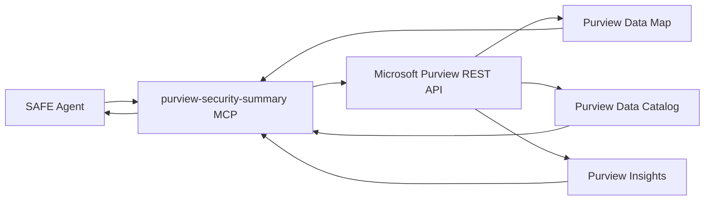

# Guide: Building a Purview Security Summary Tool

This guide shows how to create a custom MCP tool that queries **Microsoft Purview** to expose security and compliance summaries — data sensitivity classifications, access activity, and data lineage — to SAFE Framework agents.

---

## What This Tool Provides

A `purview-security-summary` MCP tool that agents can call to:

- **Classify data assets** — understand sensitivity labels on data used in a route
- **Summarise access activity** — who accessed what data and when
- **Report compliance posture** — whether data handling meets policy
- **Expose data lineage** — trace data flow from source to agent output

**Use case example:** A `gate-guard` agent calls `purview_get_sensitivity()` before processing any document. If the document is labelled `Highly Confidential`, the guard blocks processing and escalates to the data owner.

---

## Architecture



---

## Prerequisites

- Microsoft Purview account provisioned
- Managed Identity with `Purview Data Reader` role on the Purview account
- Python packages: `azure-purview-catalog`, `azure-purview-scanning`, `azure-identity`

```bash
pip install azure-purview-catalog azure-purview-scanning azure-identity
```

---

## Step 1: Implement the MCP Server

Create the server at `safe_framework/tools/mcp/purview_mcp.py`:

```python
"""
purview-security-summary MCP Server

Exposes Microsoft Purview security and compliance data to SAFE agents.
"""
import os
import logging
from datetime import datetime, timedelta
from typing import Optional
from azure.identity import DefaultAzureCredential
from azure.purview.catalog import PurviewCatalogClient
from mcp.server import FastMCP

logger = logging.getLogger(__name__)
mcp = FastMCP("purview-security-summary")

PURVIEW_ENDPOINT = os.environ.get("PURVIEW_ENDPOINT", "")
# e.g. "https://<account>.purview.azure.com"


def _get_catalog_client() -> PurviewCatalogClient:
    credential = DefaultAzureCredential()
    return PurviewCatalogClient(endpoint=PURVIEW_ENDPOINT, credential=credential)


@mcp.tool()
async def purview_get_sensitivity(
    asset_id: str,
    asset_type: str = "file",
) -> dict:
    """
    Get the sensitivity label and classification for a data asset.

    Args:
        asset_id: The Purview qualified name or GUID of the asset
                  (e.g., "https://storage.blob.core.windows.net/container/file.docx")
        asset_type: Asset type hint: "file", "table", "schema", "database"

    Returns:
        {
            "asset_id": str,
            "sensitivity_label": str,    # "Public", "General", "Confidential",
                                         # "Highly Confidential", "Restricted"
            "classification_labels": list[str],
            "data_owner": str,
            "handling_requirements": list[str],
            "can_be_processed": bool,    # False for Restricted assets
        }
    """
    client = _get_catalog_client()

    # Search for the entity by qualified name
    search_result = client.discovery.query(
        body={"keywords": asset_id, "limit": 1}
    )

    entities = list(search_result.get("value", []))
    if not entities:
        return {
            "asset_id": asset_id,
            "sensitivity_label": "Unknown",
            "classification_labels": [],
            "data_owner": "Unknown",
            "handling_requirements": ["Cannot classify — asset not found in Purview"],
            "can_be_processed": False,
        }

    entity = entities[0]
    guid = entity.get("id", "")

    # Fetch detailed entity information
    detail = client.entity.get_by_guid(guid=guid)
    entity_def = detail.get("entity", {})

    # Extract sensitivity and classifications
    attrs = entity_def.get("attributes", {})
    classifications = [
        c.get("typeName", "")
        for c in entity_def.get("classifications", [])
    ]

    # Map Microsoft Information Protection labels
    mip_label = attrs.get("label", {}).get("displayName", "")
    sensitivity = _map_mip_to_level(mip_label, classifications)

    # Determine handling requirements
    handling = _get_handling_requirements(sensitivity)

    return {
        "asset_id": asset_id,
        "guid": guid,
        "sensitivity_label": sensitivity,
        "mip_label": mip_label,
        "classification_labels": classifications,
        "data_owner": attrs.get("owner", "Unknown"),
        "last_modified": attrs.get("modifiedTime", ""),
        "handling_requirements": handling,
        "can_be_processed": sensitivity not in ("Restricted",),
    }


@mcp.tool()
async def purview_get_access_activity(
    asset_id: str,
    days_back: int = 30,
    limit: int = 50,
) -> dict:
    """
    Get recent access activity for a data asset.

    Args:
        asset_id: Purview qualified name or GUID
        days_back: How many days of history to return (max 90)
        limit: Maximum number of access records to return

    Returns:
        {
            "asset_id": str,
            "access_count": int,
            "unique_users": list[str],
            "access_records": list[{user, timestamp, operation, application}],
            "anomalies": list[str],      # Unusual access patterns detected
        }
    """
    client = _get_catalog_client()
    since = (datetime.utcnow() - timedelta(days=min(days_back, 90))).isoformat()

    # Note: Access activity is available via Purview Insights REST API
    # This uses the Data Catalog audit log endpoint
    try:
        audit_logs = client.entity.get_audit_events(
            guid=asset_id,
            start_time=since,
            count=limit,
        )
    except Exception as e:
        logger.warning(f"Could not fetch audit logs for {asset_id}: {e}")
        audit_logs = []

    records = [
        {
            "user": log.get("userUpn", "unknown"),
            "timestamp": log.get("timestamp", ""),
            "operation": log.get("operation", ""),
            "application": log.get("clientId", ""),
        }
        for log in audit_logs
    ]

    unique_users = list({r["user"] for r in records})
    anomalies = _detect_anomalies(records)

    return {
        "asset_id": asset_id,
        "period_days": days_back,
        "access_count": len(records),
        "unique_users": unique_users,
        "access_records": records,
        "anomalies": anomalies,
    }


@mcp.tool()
async def purview_get_compliance_posture(
    data_category: str,
    regulation: str = "GDPR",
) -> dict:
    """
    Get the compliance posture for a category of data.

    Args:
        data_category: Category of data (e.g., "personal", "financial", "health")
        regulation: Regulation to assess against ("GDPR", "HIPAA", "SOC2", "ISO27001")

    Returns:
        {
            "data_category": str,
            "regulation": str,
            "compliant": bool,
            "compliance_score": float,   # 0.0 – 1.0
            "gaps": list[str],
            "recommendations": list[str],
        }
    """
    client = _get_catalog_client()

    # Query Purview Insights for compliance summary
    # This uses the compliance management API (preview in some tenants)
    try:
        insights = client.discovery.query(body={
            "keywords": data_category,
            "filter": {"classification": _get_regulation_classifications(regulation)},
            "facets": [{"count": 5, "facet": "sensitivityLabel"}],
        })

        total = insights.get("@search.count", 0)
        labeled_count = sum(
            f.get("count", 0)
            for f in insights.get("@search.facets", {}).get("sensitivityLabel", [])
            if f.get("value") != "None"
        )

        score = labeled_count / total if total > 0 else 0.0
        gaps = []
        if score < 0.9:
            gaps.append(f"{int((1 - score) * 100)}% of assets lack sensitivity labels")
        if score < 0.7:
            gaps.append("Critical gap: majority of assets are unclassified")

        return {
            "data_category": data_category,
            "regulation": regulation,
            "total_assets": total,
            "classified_assets": labeled_count,
            "compliant": score >= 0.9,
            "compliance_score": round(score, 3),
            "gaps": gaps,
            "recommendations": _get_compliance_recommendations(score, regulation),
        }

    except Exception as e:
        return {
            "data_category": data_category,
            "regulation": regulation,
            "compliant": False,
            "compliance_score": 0.0,
            "gaps": [f"Could not assess compliance: {str(e)}"],
            "recommendations": ["Ensure Purview account has Data Map enabled"],
        }


@mcp.tool()
async def purview_get_data_lineage(
    asset_id: str,
    direction: str = "both",
    depth: int = 3,
) -> dict:
    """
    Get data lineage for an asset — what feeds into it and what it feeds.

    Args:
        asset_id: Purview GUID of the asset
        direction: "upstream", "downstream", or "both"
        depth: How many hops to trace (max 5)

    Returns:
        {
            "asset_id": str,
            "upstream": list[LineageNode],
            "downstream": list[LineageNode],
            "graph_summary": str,
        }
    """
    client = _get_catalog_client()

    lineage = client.lineage.get_lineage_graph(
        guid=asset_id,
        direction=direction,
        depth=min(depth, 5),
    )

    upstream = [
        {"id": n.get("guid"), "name": n.get("displayText"), "type": n.get("typeName")}
        for n in lineage.get("guidEntityMap", {}).values()
        if n.get("guid") != asset_id
    ]

    return {
        "asset_id": asset_id,
        "upstream": upstream if direction in ("upstream", "both") else [],
        "downstream": [] if direction == "upstream" else upstream,
        "edge_count": len(lineage.get("relations", [])),
        "graph_summary": f"{len(upstream)} related assets found within {depth} hops",
    }


# ── Helpers ──────────────────────────────────────────────────────────────────

def _map_mip_to_level(mip_label: str, classifications: list) -> str:
    mapping = {
        "Public": "Public",
        "General": "General",
        "Confidential": "Confidential",
        "Highly Confidential": "Highly Confidential",
        "Restricted": "Restricted",
    }
    if mip_label in mapping:
        return mapping[mip_label]
    # Infer from classification labels
    if any("PII" in c or "PersonalData" in c for c in classifications):
        return "Confidential"
    if any("Financial" in c or "Payment" in c for c in classifications):
        return "Highly Confidential"
    return "General"


def _get_handling_requirements(sensitivity: str) -> list:
    requirements = {
        "Public": ["No special handling required"],
        "General": ["Internal use only", "Do not share externally without approval"],
        "Confidential": [
            "Encrypt at rest and in transit",
            "Need-to-know access only",
            "Log all access events",
        ],
        "Highly Confidential": [
            "Encrypt with customer-managed keys",
            "Access requires manager approval",
            "No storage in non-compliant regions",
            "Audit all access in real time",
        ],
        "Restricted": [
            "Processing blocked — contact data owner",
            "Requires legal and compliance review",
        ],
    }
    return requirements.get(sensitivity, ["Unknown sensitivity level"])


def _detect_anomalies(records: list) -> list:
    anomalies = []
    if len(records) > 100:
        anomalies.append("Unusually high access volume in period")
    users_per_hour = {}
    for r in records:
        hour = r["timestamp"][:13] if r["timestamp"] else ""
        users_per_hour.setdefault(hour, set()).add(r["user"])
    if any(len(v) > 10 for v in users_per_hour.values()):
        anomalies.append("More than 10 unique users in a single hour")
    return anomalies


def _get_regulation_classifications(regulation: str) -> list:
    mapping = {
        "GDPR": ["PersonalData", "PII", "GDPR"],
        "HIPAA": ["PHI", "Health", "Medical"],
        "SOC2": ["Financial", "CustomerData"],
        "ISO27001": ["Confidential", "Restricted"],
    }
    return mapping.get(regulation, [])


def _get_compliance_recommendations(score: float, regulation: str) -> list:
    if score >= 0.9:
        return [f"Maintain current {regulation} classification coverage"]
    recs = [f"Apply {regulation}-required sensitivity labels to unclassified assets"]
    if score < 0.7:
        recs.append("Run automated Purview scanning on all data sources")
        recs.append("Schedule compliance review with data stewards")
    return recs


if __name__ == "__main__":
    mcp.run()
```

---

## Step 2: Register in the Tool Catalog

```yaml
# safe_framework/tools/catalog.yaml  (add this entry)
- id: purview-security-summary
  display_name: Purview Security Summary
  version: "1.0"
  category: governance
  description: |
    Exposes Microsoft Purview security data to agents: sensitivity labels,
    access activity, compliance posture, and data lineage.
  authentication:
    type: managed_identity
    env_vars:
      - PURVIEW_ENDPOINT
  mcp:
    module: safe_framework.tools.mcp.purview_mcp
    port: 8004
  functions:
    - name: purview_get_sensitivity
      description: Get sensitivity label and classification for a data asset
    - name: purview_get_access_activity
      description: Get recent access activity and anomalies for a data asset
    - name: purview_get_compliance_posture
      description: Assess compliance posture for a data category
    - name: purview_get_data_lineage
      description: Trace data lineage upstream and downstream
  tags:
    - governance
    - security
    - compliance
    - purview
```

---

## Step 3: Use in a Gate-Guard Agent

```yaml
# An enhanced gate-guard that checks data sensitivity before processing
tools:
  - id: purview-security-summary
    purpose: "Check data sensitivity labels before processing any asset"
```

```python
# In the gate-guard agent's prompt or invoke logic:
sensitivity = await purview_get_sensitivity(asset_id=document_url)
if not sensitivity["can_be_processed"]:
    return {
        "passed": False,
        "reason": f"Document is {sensitivity['sensitivity_label']} — cannot process without approval",
        "escalate_to": sensitivity["data_owner"],
    }
```

---

## Step 4: Start the MCP Server

```bash
export PURVIEW_ENDPOINT="https://<account>.purview.azure.com"

# Using Managed Identity (production)
python -m safe_framework.tools.mcp.purview_mcp

# Or start on a specific port
python safe_framework/tools/mcp/purview_mcp.py --port 8004
```
