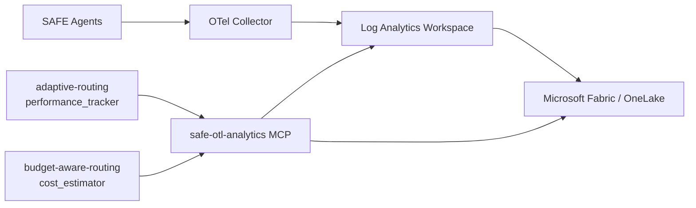

# Guide: Building an OTL Analytics Tool

This guide shows how to create a custom MCP tool that queries **OpenTelemetry (OTL) telemetry data** from the Azure AI Foundry data pipeline — exposing agent performance metrics, token usage, latency distributions, and route health signals to SAFE agents.

---

## What This Tool Provides

A `safe-otl-analytics` MCP tool that agents (particularly monitoring, planning, and adaptive-routing roles) can call to:

- **Query agent performance metrics** — latency, error rate, throughput by agent and route
- **Analyse token usage patterns** — input/output token distribution by model and time period
- **Identify slow or failing agents** — P95/P99 latency, error spikes
- **Feed adaptive routing** — real-time performance signals for model/route selection

**Primary consumer:** The `performance_tracker` role in the `adaptive-routing` pattern.

---

## Architecture



---

## Prerequisites

- Azure Monitor / Log Analytics Workspace with OTel data ingested
- Optional: Microsoft Fabric workspace with OTel data in OneLake
- Python packages: `azure-monitor-query`, `azure-identity`

```bash
pip install azure-monitor-query azure-identity
```

---

## Step 1: Configure OTel Data Ingestion

SAFE Framework routes emit OpenTelemetry traces automatically via the execution engine. To ingest these into Log Analytics:

```python
# Add to your route initialization
from opentelemetry import trace
from opentelemetry.sdk.trace import TracerProvider
from opentelemetry.sdk.trace.export import BatchSpanProcessor
from azure.monitor.opentelemetry.exporter import AzureMonitorTraceExporter

provider = TracerProvider()
exporter = AzureMonitorTraceExporter(
    connection_string=os.environ["APPLICATIONINSIGHTS_CONNECTION_STRING"]
)
provider.add_span_processor(BatchSpanProcessor(exporter))
trace.set_tracer_provider(provider)

# Now all agent invocations emit traces to Application Insights / Log Analytics
```

Each agent invocation emits a span with these attributes:

```
safe.route.name          = "contract-review"
safe.agent.name          = "rag-generator"
safe.agent.version       = "1.0"
safe.pattern.name        = "evaluator-optimizer"
safe.model.deployment    = "gpt-4o"
safe.tokens.input        = 1250
safe.tokens.output       = 340
safe.cost.usd            = 0.0082
safe.iteration           = 2
http.status_code         = 200
duration                 = 3421  (ms)
```

---

## Step 2: Implement the MCP Server

Create `safe_framework/tools/mcp/otl_analytics_mcp.py`:

```python
"""
safe-otl-analytics MCP Server

Queries OTel telemetry data from Azure Log Analytics / Application Insights
to provide real-time performance metrics to SAFE agents.
"""
import os
import logging
from datetime import datetime, timedelta, timezone
from azure.identity import DefaultAzureCredential
from azure.monitor.query import LogsQueryClient, MetricsQueryClient
from azure.monitor.query import LogsQueryStatus
from mcp.server import FastMCP

logger = logging.getLogger(__name__)
mcp = FastMCP("safe-otl-analytics")

WORKSPACE_ID = os.environ.get("LOG_ANALYTICS_WORKSPACE_ID", "")


def _logs_client() -> LogsQueryClient:
    return LogsQueryClient(DefaultAzureCredential())


@mcp.tool()
async def otl_get_agent_metrics(
    agent_name: str = None,
    route_name: str = None,
    time_range_hours: int = 24,
) -> dict:
    """
    Get performance metrics for a specific agent or route over a time window.

    Args:
        agent_name: Filter to a specific agent (e.g., "rag-generator")
        route_name: Filter to a specific route (e.g., "contract-review")
        time_range_hours: Hours of history to query (max 168 = 7 days)

    Returns:
        {
            "agent_name": str,
            "route_name": str,
            "time_range_hours": int,
            "total_invocations": int,
            "success_rate": float,
            "error_rate": float,
            "latency_p50_ms": float,
            "latency_p95_ms": float,
            "latency_p99_ms": float,
            "avg_input_tokens": float,
            "avg_output_tokens": float,
            "total_cost_usd": float,
            "models_used": list[str],
        }
    """
    client = _logs_client()
    duration_hours = min(time_range_hours, 168)

    # Build KQL filter
    filters = []
    if agent_name:
        filters.append(f'customDimensions["safe.agent.name"] == "{agent_name}"')
    if route_name:
        filters.append(f'customDimensions["safe.route.name"] == "{route_name}"')
    where_clause = " and ".join(filters) if filters else "true"

    kql = f"""
    dependencies
    | where timestamp > ago({duration_hours}h)
    | where {where_clause}
    | extend
        agent = tostring(customDimensions["safe.agent.name"]),
        route = tostring(customDimensions["safe.route.name"]),
        input_tokens = toint(customDimensions["safe.tokens.input"]),
        output_tokens = toint(customDimensions["safe.tokens.output"]),
        cost_usd = todouble(customDimensions["safe.cost.usd"]),
        model = tostring(customDimensions["safe.model.deployment"])
    | summarize
        total_invocations = count(),
        success_count = countif(success == true),
        latency_p50 = percentile(duration, 50),
        latency_p95 = percentile(duration, 95),
        latency_p99 = percentile(duration, 99),
        avg_input_tokens = avg(input_tokens),
        avg_output_tokens = avg(output_tokens),
        total_cost = sum(cost_usd),
        models = make_set(model)
    """

    try:
        result = client.query_workspace(
            workspace_id=WORKSPACE_ID,
            query=kql,
            timespan=timedelta(hours=duration_hours),
        )

        if result.status == LogsQueryStatus.SUCCESS and result.tables:
            row = result.tables[0].rows[0] if result.tables[0].rows else None
            if row:
                total = int(row[0]) if row[0] else 0
                success = int(row[1]) if row[1] else 0
                return {
                    "agent_name": agent_name or "all",
                    "route_name": route_name or "all",
                    "time_range_hours": duration_hours,
                    "total_invocations": total,
                    "success_rate": round(success / total, 4) if total > 0 else 0.0,
                    "error_rate": round(1 - success / total, 4) if total > 0 else 0.0,
                    "latency_p50_ms": round(float(row[2] or 0), 1),
                    "latency_p95_ms": round(float(row[3] or 0), 1),
                    "latency_p99_ms": round(float(row[4] or 0), 1),
                    "avg_input_tokens": round(float(row[5] or 0), 0),
                    "avg_output_tokens": round(float(row[6] or 0), 0),
                    "total_cost_usd": round(float(row[7] or 0), 4),
                    "models_used": list(row[8]) if row[8] else [],
                }

    except Exception as e:
        logger.error(f"OTL query failed: {e}")

    return _empty_metrics(agent_name, route_name, duration_hours)


@mcp.tool()
async def otl_get_route_comparison(
    route_names: list,
    metric: str = "latency_p95",
    time_range_hours: int = 24,
) -> dict:
    """
    Compare performance metrics across multiple routes.

    Args:
        route_names: List of route names to compare
        metric: Metric to compare: "latency_p95", "error_rate", "cost_usd", "throughput"
        time_range_hours: Hours of history

    Returns:
        {
            "metric": str,
            "rankings": list[{route, value, rank}],
            "best_route": str,
            "worst_route": str,
            "recommendation": str,
        }
    """
    results = []
    for route in route_names:
        metrics = await otl_get_agent_metrics(route_name=route, time_range_hours=time_range_hours)
        metric_value = {
            "latency_p95": metrics["latency_p95_ms"],
            "error_rate": metrics["error_rate"],
            "cost_usd": metrics["total_cost_usd"],
            "throughput": metrics["total_invocations"] / time_range_hours,
        }.get(metric, 0)
        results.append({"route": route, "value": metric_value})

    # Lower is better for latency, error_rate, cost; higher is better for throughput
    reverse = metric == "throughput"
    ranked = sorted(results, key=lambda x: x["value"], reverse=reverse)
    for i, r in enumerate(ranked):
        r["rank"] = i + 1

    return {
        "metric": metric,
        "time_range_hours": time_range_hours,
        "rankings": ranked,
        "best_route": ranked[0]["route"] if ranked else None,
        "worst_route": ranked[-1]["route"] if ranked else None,
        "recommendation": _make_comparison_recommendation(ranked, metric),
    }


@mcp.tool()
async def otl_get_cost_breakdown(
    time_range_hours: int = 24,
    group_by: str = "route",
) -> dict:
    """
    Get token usage and cost breakdown.

    Args:
        time_range_hours: Hours of history to analyse
        group_by: Group results by "route", "agent", or "model"

    Returns:
        {
            "total_cost_usd": float,
            "total_input_tokens": int,
            "total_output_tokens": int,
            "breakdown": list[{name, cost_usd, input_tokens, output_tokens, pct_of_total}],
            "top_spender": str,
        }
    """
    client = _logs_client()
    group_field = {
        "route": 'customDimensions["safe.route.name"]',
        "agent": 'customDimensions["safe.agent.name"]',
        "model": 'customDimensions["safe.model.deployment"]',
    }.get(group_by, 'customDimensions["safe.route.name"]')

    kql = f"""
    dependencies
    | where timestamp > ago({time_range_hours}h)
    | extend
        group_key = tostring({group_field}),
        input_tokens = toint(customDimensions["safe.tokens.input"]),
        output_tokens = toint(customDimensions["safe.tokens.output"]),
        cost_usd = todouble(customDimensions["safe.cost.usd"])
    | summarize
        total_cost = sum(cost_usd),
        total_input = sum(input_tokens),
        total_output = sum(output_tokens)
    by group_key
    | order by total_cost desc
    """

    try:
        result = client.query_workspace(
            workspace_id=WORKSPACE_ID,
            query=kql,
            timespan=timedelta(hours=time_range_hours),
        )
        if result.status == LogsQueryStatus.SUCCESS and result.tables:
            rows = result.tables[0].rows
            total_cost = sum(float(r[1] or 0) for r in rows)
            breakdown = [
                {
                    "name": str(r[0]),
                    "cost_usd": round(float(r[1] or 0), 4),
                    "input_tokens": int(r[2] or 0),
                    "output_tokens": int(r[3] or 0),
                    "pct_of_total": round(float(r[1] or 0) / total_cost * 100, 1) if total_cost > 0 else 0,
                }
                for r in rows
            ]
            return {
                "time_range_hours": time_range_hours,
                "group_by": group_by,
                "total_cost_usd": round(total_cost, 4),
                "total_input_tokens": sum(b["input_tokens"] for b in breakdown),
                "total_output_tokens": sum(b["output_tokens"] for b in breakdown),
                "breakdown": breakdown,
                "top_spender": breakdown[0]["name"] if breakdown else None,
            }
    except Exception as e:
        logger.error(f"Cost breakdown query failed: {e}")

    return {
        "total_cost_usd": 0.0,
        "total_input_tokens": 0,
        "total_output_tokens": 0,
        "breakdown": [],
        "top_spender": None,
    }


@mcp.tool()
async def otl_get_anomalies(
    sensitivity: str = "medium",
    time_range_hours: int = 1,
) -> dict:
    """
    Detect performance anomalies in recent agent activity.

    Args:
        sensitivity: Anomaly detection sensitivity: "low", "medium", "high"
        time_range_hours: Recent window to check (default: last 1 hour)

    Returns:
        {
            "anomalies": list[Anomaly],
            "severity": str,
            "affected_routes": list[str],
            "recommended_actions": list[str],
        }
    """
    # Get current metrics vs baseline (past 24h vs past 1h)
    baseline = await otl_get_agent_metrics(time_range_hours=24)
    current = await otl_get_agent_metrics(time_range_hours=time_range_hours)

    thresholds = {
        "low": {"latency_pct": 2.0, "error_rate_abs": 0.10},
        "medium": {"latency_pct": 1.5, "error_rate_abs": 0.05},
        "high": {"latency_pct": 1.2, "error_rate_abs": 0.02},
    }[sensitivity]

    anomalies = []
    baseline_p95 = baseline.get("latency_p95_ms", 0)
    current_p95 = current.get("latency_p95_ms", 0)

    if baseline_p95 > 0 and current_p95 > baseline_p95 * thresholds["latency_pct"]:
        anomalies.append({
            "type": "latency_spike",
            "severity": "warning",
            "message": f"P95 latency {current_p95:.0f}ms vs baseline {baseline_p95:.0f}ms",
        })

    baseline_err = baseline.get("error_rate", 0)
    current_err = current.get("error_rate", 0)
    if current_err > baseline_err + thresholds["error_rate_abs"]:
        anomalies.append({
            "type": "error_rate_spike",
            "severity": "critical" if current_err > 0.1 else "warning",
            "message": f"Error rate {current_err:.1%} vs baseline {baseline_err:.1%}",
        })

    severity = "critical" if any(a["severity"] == "critical" for a in anomalies) \
               else "warning" if anomalies else "healthy"

    return {
        "anomalies": anomalies,
        "anomaly_count": len(anomalies),
        "severity": severity,
        "recommended_actions": _anomaly_recommendations(anomalies),
    }


# ── Helpers ──────────────────────────────────────────────────────────────────

def _empty_metrics(agent_name, route_name, hours):
    return {
        "agent_name": agent_name or "all",
        "route_name": route_name or "all",
        "time_range_hours": hours,
        "total_invocations": 0,
        "success_rate": 0.0, "error_rate": 0.0,
        "latency_p50_ms": 0.0, "latency_p95_ms": 0.0, "latency_p99_ms": 0.0,
        "avg_input_tokens": 0.0, "avg_output_tokens": 0.0,
        "total_cost_usd": 0.0, "models_used": [],
    }


def _make_comparison_recommendation(ranked, metric):
    if not ranked:
        return "No data available"
    best = ranked[0]["route"]
    worst = ranked[-1]["route"]
    metric_label = {
        "latency_p95": "lowest P95 latency",
        "error_rate": "lowest error rate",
        "cost_usd": "lowest cost",
        "throughput": "highest throughput",
    }.get(metric, metric)
    return f"Route '{best}' has the {metric_label}. Consider routing more traffic away from '{worst}'."


def _anomaly_recommendations(anomalies):
    recs = []
    for a in anomalies:
        if a["type"] == "latency_spike":
            recs.append("Check Azure AI Foundry model endpoint health")
            recs.append("Consider switching to a lower-latency model deployment")
        if a["type"] == "error_rate_spike":
            recs.append("Review recent route changes in git history")
            recs.append("Check agent contract validation for input schema changes")
    return list(dict.fromkeys(recs))  # deduplicate


if __name__ == "__main__":
    mcp.run()
```

---

## Step 3: Register in the Tool Catalog

```yaml
# safe_framework/tools/catalog.yaml
- id: safe-otl-analytics
  display_name: SAFE OTL Analytics
  version: "1.0"
  category: safe-mcp
  description: |
    Queries OTel telemetry from Log Analytics to expose agent performance
    metrics, cost breakdown, and anomaly detection to SAFE agents.
  authentication:
    type: managed_identity
    env_vars:
      - LOG_ANALYTICS_WORKSPACE_ID
  mcp:
    module: safe_framework.tools.mcp.otl_analytics_mcp
    port: 8005
  functions:
    - name: otl_get_agent_metrics
    - name: otl_get_route_comparison
    - name: otl_get_cost_breakdown
    - name: otl_get_anomalies
  tags:
    - observability
    - analytics
    - performance
    - cost
```

---

## Step 4: Start the MCP Server

```bash
export LOG_ANALYTICS_WORKSPACE_ID="<workspace-guid>"

python -m safe_framework.tools.mcp.otl_analytics_mcp
# or
python safe_framework/tools/mcp/otl_analytics_mcp.py --port 8005
```

---

## Step 5: Use in the Adaptive Routing Pattern

The `performance_tracker` role in `adaptive-routing` calls this tool on every routing decision:

```yaml
# safe_framework/agents/patterns/adaptive-routing/performance_tracker/agent.yaml
tools:
  - id: safe-otl-analytics
    purpose: "Fetch real-time latency and error metrics to inform routing decisions"
```

```python
# The performance_tracker agent's invoke logic
metrics = await otl_get_agent_metrics(time_range_hours=1)
if metrics["error_rate"] > 0.05 or metrics["latency_p95_ms"] > 5000:
    # Signal the router to switch to a backup model/route
    return {"route_to": "fallback", "reason": "primary degraded", "metrics": metrics}
return {"route_to": "primary", "metrics": metrics}
```

---

## Querying Fabric / OneLake

If your OTel data is also stored in Microsoft Fabric (OneLake), use the `iq-fabric` tool for longer-term analytics and trend reporting:

```python
# Via safe tool — iq-fabric with DAX
result = await iq_fabric_query(
    dataset_id="safe-telemetry-dataset",
    dax_query="""
    EVALUATE
    SUMMARIZECOLUMNS(
        'AgentMetrics'[RouteName],
        'AgentMetrics'[AgentName],
        "AvgLatency", AVERAGE('AgentMetrics'[DurationMs]),
        "TotalCost", SUM('AgentMetrics'[CostUsd]),
        "ErrorRate", DIVIDE(
            COUNTROWS(FILTER('AgentMetrics', 'AgentMetrics'[Success] = FALSE)),
            COUNTROWS('AgentMetrics')
        )
    )
    """,
)
```
