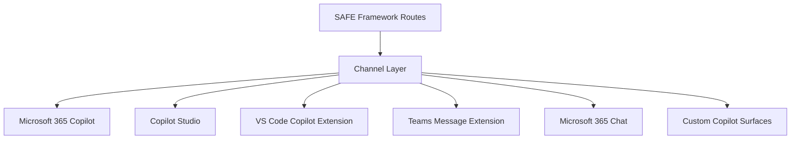

# Guide: Agent Channels

This guide shows how to connect SAFE Framework agents to Microsoft 365, Copilot Studio, VS Code Copilot, and other Microsoft Copilot surfaces using plugin/MCP capabilities.

---

## Channel Overview



| Channel | Protocol | Best For |
|---|---|---|
| Microsoft 365 Copilot | MCP Plugin | Org-wide deployment to licensed M365 users |
| Copilot Studio | Custom connector / Power Platform | Low-code builder for specific dept workflows |
| VS Code Copilot | VS Code extension API | Developer tools and code-related agents |
| Teams Message Extension | Bot Framework | Teams-native interactions |
| Microsoft 365 Chat | Declarative Copilot | Discovery-based chat integration |

---

## 1. Microsoft 365 Copilot via MCP Plugin

Microsoft is rolling out MCP as the standard extension protocol for M365 Copilot. Once available in your tenant, you can expose any SAFE route as an M365 Copilot plugin via an MCP manifest.

### Step 1: Create an MCP Server Manifest

```json
// .well-known/mcp.json  (served at your API endpoint root)
{
  "schema_version": "v1",
  "name_for_human": "Contract Review Agent",
  "name_for_model": "contract_review",
  "description_for_human": "Review supplier contracts for risk and compliance",
  "description_for_model": "Analyses contract text for legal risk, compliance gaps, and financial exposure. Returns a structured risk assessment with recommendations.",
  "auth": {
    "type": "oauth2",
    "client_url": "https://login.microsoftonline.com/<tenant-id>/oauth2/v2.0/authorize",
    "scope": "api://<app-id>/Invoke",
    "authorization_url": "https://login.microsoftonline.com/<tenant-id>/oauth2/v2.0/token"
  },
  "api": {
    "type": "openapi",
    "url": "https://<your-api>/openapi.json"
  }
}
```

### Step 2: Expose the Route as an OpenAPI Endpoint

Wrap your SAFE route with a FastAPI endpoint:

```python
# api/contract_review_api.py
import os
from fastapi import FastAPI, Depends, HTTPException
from fastapi.security import OAuth2AuthorizationCodeBearer
from pydantic import BaseModel
from semantic_kernel import Kernel
from routes.contract_review.route import ContractReviewRoute

app = FastAPI(
    title="Contract Review Agent API",
    description="SAFE Framework contract review route exposed as an M365 Copilot plugin",
    version="1.0",
)

class ContractReviewRequest(BaseModel):
    contract_text: str
    contract_id: str = "unknown"

class ContractReviewResponse(BaseModel):
    status: str
    risk_level: str = None
    report: str = None
    recommendations: list[str] = []

oauth2_scheme = OAuth2AuthorizationCodeBearer(
    authorizationUrl="https://login.microsoftonline.com/<tenant>/oauth2/v2.0/authorize",
    tokenUrl="https://login.microsoftonline.com/<tenant>/oauth2/v2.0/token",
)

@app.post("/review", response_model=ContractReviewResponse,
          summary="Review a contract for risk and compliance")
async def review_contract(
    request: ContractReviewRequest,
    token: str = Depends(oauth2_scheme),
):
    """
    Analyses the provided contract text and returns a risk assessment.
    Use this when the user asks to review a contract, check a supplier agreement,
    or assess legal risk in a document.
    """
    kernel = Kernel()
    # configure kernel ...
    route = ContractReviewRoute(kernel=kernel)
    result = await route.invoke({
        "contract_id": request.contract_id,
        "contract_text": request.contract_text,
    })
    return ContractReviewResponse(**result)
```

### Step 3: Register in Microsoft 365 Admin Center

1. Navigate to [Microsoft 365 Admin Center](https://admin.microsoft.com)
2. Go to **Settings → Integrated apps → Upload custom apps**
3. Select **MCP Plugin** as the app type
4. Upload your `mcp.json` manifest
5. Assign to pilot users or all users

Once deployed, users can invoke your agent directly from M365 Copilot chat:

> "Copilot, review this contract for me" → M365 Copilot routes to your plugin

---

## 2. Copilot Studio (Power Platform)

Copilot Studio lets you build custom Copilots for specific departments without code, then wire them to SAFE Framework routes via Power Automate connectors or Azure Logic Apps.

### Step 1: Create a Custom Connector

Export your SAFE route API as a Swagger/OpenAPI spec:

```bash
# Generate OpenAPI spec from FastAPI
curl http://localhost:8000/openapi.json > safe-contract-review.json
```

In Copilot Studio:
1. Go to **Power Platform Admin Center → Custom Connectors**
2. Click **New custom connector → Import an OpenAPI file**
3. Upload `safe-contract-review.json`
4. Configure authentication (OAuth2 or API Key)
5. Test the connector with a sample contract

### Step 2: Create a Copilot Studio Bot

```yaml
# Copilot Studio topic: "Review a Contract"
trigger_phrases:
  - "review contract"
  - "check this agreement"
  - "analyse contract"

actions:
  - type: ask_for_input
    question: "Please paste the contract text or share the document URL"
    variable: contract_text

  - type: call_action
    action: ContractReviewConnector.Review
    inputs:
      contract_text: "{contract_text}"
    output: review_result

  - type: send_message
    message: |
      **Contract Review Complete**

      Risk Level: {review_result.risk_level}

      {review_result.report}

      **Recommendations:**
      {review_result.recommendations}
```

### Step 3: Deploy to Teams or SharePoint

From Copilot Studio, publish the bot to:
- **Microsoft Teams** — appears as a Teams app
- **SharePoint** — embedded in intranet pages
- **Microsoft 365 Chat** — available in BizChat

---

## 3. VS Code Copilot (GitHub Copilot Extension)

VS Code Copilot extensions (chat participants) let engineers invoke SAFE agents from within their editor — useful for code review agents, architecture advisors, and documentation generators.

### Create a VS Code Chat Participant

```typescript
// src/extension.ts
import * as vscode from 'vscode';

export function activate(context: vscode.ExtensionContext) {
    const agent = vscode.chat.createChatParticipant(
        'safe-agent',
        handleChatRequest
    );
    agent.iconPath = vscode.Uri.joinPath(context.extensionUri, 'media', 'safe-logo.png');
}

async function handleChatRequest(
    request: vscode.ChatRequest,
    chatContext: vscode.ChatContext,
    stream: vscode.ChatResponseStream,
    token: vscode.CancellationToken
): Promise<vscode.ChatResult> {

    if (request.command === 'review') {
        // Get selected text from editor
        const editor = vscode.window.activeTextEditor;
        const selectedText = editor?.document.getText(editor.selection) || '';

        stream.markdown('🔍 Reviewing with SAFE Framework...\n\n');

        // Call the SAFE route API
        const response = await fetch('https://<your-api>/review', {
            method: 'POST',
            headers: {'Content-Type': 'application/json'},
            body: JSON.stringify({
                contract_text: selectedText,
                contract_id: 'vscode-review',
            }),
        });

        const result = await response.json();

        stream.markdown(`**Risk Level:** ${result.risk_level}\n\n`);
        stream.markdown(result.report);

        if (result.recommendations?.length) {
            stream.markdown('\n\n**Recommendations:**\n');
            result.recommendations.forEach((rec: string) => {
                stream.markdown(`- ${rec}\n`);
            });
        }

        return {};
    }

    stream.markdown('Use `@safe-agent /review` to review selected text with the SAFE contract review agent.');
    return {};
}
```

### Usage in VS Code

After installing the extension:

```
@safe-agent /review
```

With contract text selected in the editor, this invokes the SAFE route and streams the response into the Copilot Chat panel.

---

## 4. Teams Message Extension

Expose agents as Teams message extensions — users can invoke them from the compose box or via the `...` menu on any Teams message.

### App Manifest

```json
// manifest.json
{
  "manifestVersion": "1.17",
  "id": "<app-guid>",
  "name": {"short": "SAFE Agent", "full": "SAFE Framework Contract Review"},
  "composeExtensions": [
    {
      "botId": "<bot-app-id>",
      "commands": [
        {
          "id": "reviewContract",
          "type": "action",
          "title": "Review Contract",
          "description": "Analyse a contract for risk and compliance",
          "fetchTask": true,
          "context": ["message", "compose", "commandBox"],
          "parameters": [
            {
              "name": "contractText",
              "title": "Contract Text",
              "description": "Paste contract text or summary",
              "inputType": "textarea"
            }
          ]
        }
      ]
    }
  ]
}
```

### Bot Handler

```python
# bot/contract_review_bot.py
from botbuilder.core import ActivityHandler, TurnContext
from botbuilder.schema import Activity
from routes.contract_review.route import ContractReviewRoute

class ContractReviewBot(ActivityHandler):
    async def on_message_activity(self, turn_context: TurnContext):
        text = turn_context.activity.text

        if text.startswith("review:"):
            contract_text = text[7:].strip()
            route = ContractReviewRoute(kernel=self.kernel)
            result = await route.invoke({
                "contract_id": turn_context.activity.id,
                "contract_text": contract_text,
            })

            message = f"**Risk Level:** {result['risk_level']}\n\n{result['report']}"
            await turn_context.send_activity(Activity(type="message", text=message))
```

---

## 5. Microsoft 365 Declarative Copilot

Declarative Copilots are configured via JSON and deployed to M365 Chat without code. Wire one to your SAFE API:

```json
// declarative-copilot.json
{
  "schema_version": "v1.0",
  "name": "Contract Review Copilot",
  "description": "Your contract risk expert — powered by SAFE Framework",
  "instructions": "You help users review supplier contracts. When a user provides contract text, invoke the contract_review action and present the risk assessment clearly.",
  "actions": [
    {
      "id": "contract_review",
      "file": "openapi.json"
    }
  ],
  "capabilities": [
    {"name": "OneDriveAndSharePoint"},
    {"name": "GraphConnectors",
     "connections": [{"connection_id": "contract-index"}]}
  ]
}
```

---

## 6. Future: MCP Across Copilot Surfaces

Microsoft is standardising on MCP as the extension protocol across all Copilot surfaces. As this rolls out:

- **A single MCP server** will work across M365 Copilot, Teams, Copilot Studio, and VS Code Copilot
- **Tool discovery** will be automatic — users see your tool appear in `@mention` suggestions
- **Unified authentication** via Microsoft Entra ID (no per-surface auth configuration)

To future-proof your SAFE routes, implement them as MCP servers from day one:

```bash
# Start a SAFE route as an MCP server
python -m safe_framework.tools.mcp.contract_review_mcp --port 8080

# This automatically works as:
# - An M365 Copilot plugin (when registered)
# - A Copilot Studio action
# - A VS Code MCP tool
# - Any other MCP-compatible surface
```

See [MCP Catalog Guide](05-mcp-catalog.md) for how to implement and register MCP servers.
