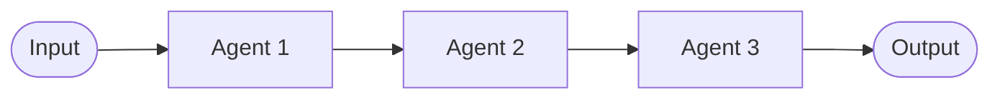
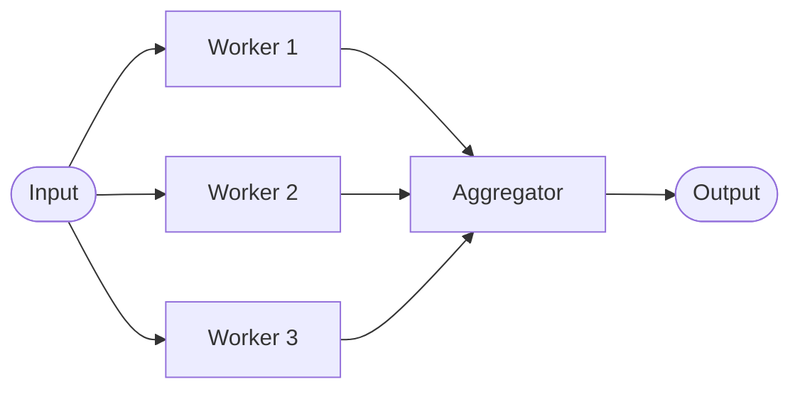
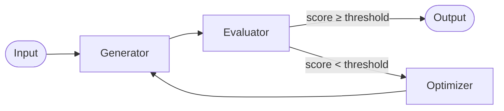
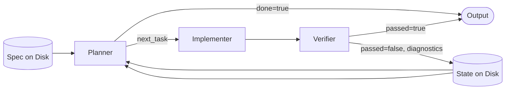
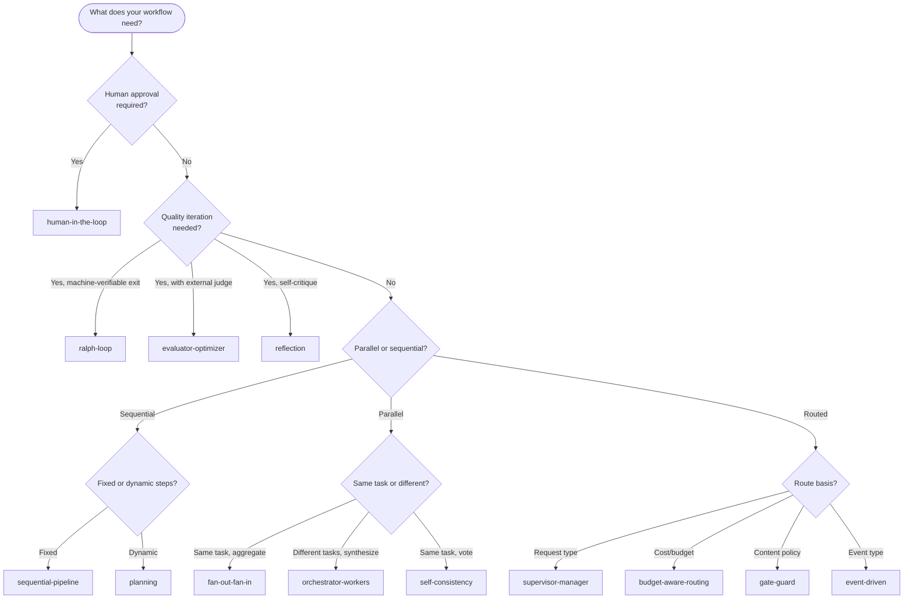

# Patterns Overview

A **pattern** in SAFE Framework describes how agents are wired together — the topology, data flow, and control logic of a multi-agent workflow. Patterns are implemented as Jinja2 templates that generate production-ready Python route code.

---

## Why Patterns?

Without patterns, every multi-agent workflow is a bespoke piece of code. Patterns give you:

- **Reusability** — the same topology works for dozens of different business tasks
- **Predictability** — each pattern has defined inputs, outputs, and failure modes
- **Governance** — patterns enforce agent contracts, enabling validation before deployment
- **Speed** — `safe route` generates production code from a pattern in seconds

---

## Pattern Anatomy

Every pattern directory contains:

```
safe_framework/agents/patterns/<pattern-name>/
├── route.py.jinja2          Jinja2 template → generates route.py
└── <role>/
    ├── agent.yaml           Contract: inputs, outputs, tools, metadata
    └── agent.md             Full documentation with Mermaid diagram
```

Patterns define **roles** (e.g., `worker`, `aggregator`, `supervisor`). When you build a route, you assign a concrete agent from the catalog to each role.

---

## Pattern Categories

| Category | Description | Patterns |
|---|---|---|
| **Sequential** | Linear flow — each step feeds the next | sequential-pipeline, planning |
| **Parallel** | Multiple agents run concurrently | fan-out-fan-in, map-reduce, orchestrator-workers, self-consistency, debate |
| **Routing** | Dynamic decision determines which agent runs | supervisor-manager, mixture-of-experts, conditional-branching, gate-guard, event-driven, budget-aware-routing, adaptive-routing, round-robin |
| **Iterative** | Loop until a condition is met | retry-loop, evaluator-optimizer, reflection, ralph-loop |
| **Convergent** | Multiple paths merge | diamond, tree-reduce, fan-out-fan-in |
| **Memory** | State persists across calls | memory-augmented, checkpoint-resume |
| **Human** | Workflow pauses for human input | human-in-the-loop |
| **Composition** | Agents compose other agents | agent-as-a-tool, hierarchical-teams |
| **Retrieval** | Fetch before generate | rag, fallback-chain |

---

## All Patterns

### Primary Patterns (Fully Implemented)

---

#### sequential-pipeline

A linear chain where each agent's output is the next agent's input. The simplest and most common pattern.

**Roles:** `processor` (repeating) → final `output`
**Use when:** Steps are ordered and each depends on the previous.

**Files:** [`safe_framework/agents/patterns/sequential-pipeline/`](../safe_framework/agents/patterns/sequential-pipeline/)



---

#### fan-out-fan-in

One input is broadcast to N parallel workers, then all results are aggregated.

**Roles:** `worker` (N instances), `aggregator`
**Use when:** You can split work into independent chunks and combine results.

**Files:** [`safe_framework/agents/patterns/fan-out-fan-in/`](../safe_framework/agents/patterns/fan-out-fan-in/)



---

#### map-reduce

Distributed batch processing: map phase processes each item, shuffle groups results, reduce phase produces final output.

**Roles:** `mapper`, `shuffler`, `reducer`
**Use when:** Processing large datasets where items can be processed independently.

**Files:** [`safe_framework/agents/patterns/map-reduce/`](../safe_framework/agents/patterns/map-reduce/)

---

#### supervisor-manager

A supervisor agent routes each request to the most appropriate specialist manager.

**Roles:** `supervisor`, `manager` (N instances), `aggregator`
**Use when:** Different request types need different specialised agents.

**Files:** [`safe_framework/agents/patterns/supervisor-manager/`](../safe_framework/agents/patterns/supervisor-manager/)

---

#### round-robin

Distributes requests across identical worker agents in rotation.

**Roles:** `worker` (N instances)
**Use when:** You need load balancing across homogeneous agents.

**Files:** [`safe_framework/agents/patterns/round-robin/`](../safe_framework/agents/patterns/round-robin/)

---

#### mixture-of-experts

A router agent selects the best expert agent for each request.

**Roles:** `router`, `expert` (N instances), `aggregator`
**Use when:** Requests vary in nature and different agents excel at different types.

**Files:** [`safe_framework/agents/patterns/mixture-of-experts/`](../safe_framework/agents/patterns/mixture-of-experts/)

---

#### hierarchical-teams

Nested team structures: team leads coordinate sub-teams of specialist agents.

**Roles:** `team_lead`, `sub_lead`, `worker`
**Use when:** Work naturally decomposes into sub-domains (e.g., legal → contracts + compliance).

**Files:** [`safe_framework/agents/patterns/hierarchical-teams/`](../safe_framework/agents/patterns/hierarchical-teams/)

---

#### fallback-chain

Tries the primary agent, then falls back to secondary, then tertiary, stopping at first success.

**Roles:** `primary`, `secondary`, `tertiary`
**Use when:** Reliability is critical and you have agents of different quality/cost.

**Files:** [`safe_framework/agents/patterns/fallback-chain/`](../safe_framework/agents/patterns/fallback-chain/)

---

#### retry-loop

Retries a worker agent until a validator passes or a maximum iteration count is reached.

**Roles:** `worker`, `validator`
**Use when:** Output quality is variable and must meet a defined standard.

**Files:** [`safe_framework/agents/patterns/retry-loop/`](../safe_framework/agents/patterns/retry-loop/)

---

#### diamond

Input flows to two parallel branches, both converge at a merge agent.

**Roles:** `splitter`, `branch_a`, `branch_b`, `merger`
**Use when:** Two independent analysis perspectives are needed before synthesis.

**Files:** [`safe_framework/agents/patterns/diamond/`](../safe_framework/agents/patterns/diamond/)

---

#### conditional-branching

A router agent evaluates conditions and directs the workflow to the matching branch.

**Roles:** `router`, `branch_*` (N branches), `output_handler`
**Use when:** Different conditions require fundamentally different processing paths.

**Files:** [`safe_framework/agents/patterns/conditional-branching/`](../safe_framework/agents/patterns/conditional-branching/)

---

#### tree-reduce

A hierarchical reduction: pairs of agents reduce inputs at each level until a single result remains.

**Roles:** `leaf_processor`, `node_reducer`, `root_reducer`
**Use when:** Combining large volumes of results hierarchically (e.g., document clustering).

**Files:** [`safe_framework/agents/patterns/tree-reduce/`](../safe_framework/agents/patterns/tree-reduce/)

---

### Backlog Patterns (Templates + Docs Complete)

---

#### evaluator-optimizer

Generator produces a draft, evaluator scores it, optimizer refines the prompt — loops until quality threshold met.

**Roles:** `generator`, `evaluator`, `optimizer`
**Use when:** Output quality must meet a defined score threshold; creative or analytical tasks.

**Files:** [`safe_framework/agents/patterns/evaluator-optimizer/`](../safe_framework/agents/patterns/evaluator-optimizer/)



---

#### human-in-the-loop

Pre-validator prepares the request, human gate suspends for manual review, post-processor finalises.

**Roles:** `pre_validator`, `human_gate`, `post_processor`
**Use when:** Regulatory compliance, high-risk decisions, or executive approval required.

**Files:** [`safe_framework/agents/patterns/human-in-the-loop/`](../safe_framework/agents/patterns/human-in-the-loop/)

**Requires:** `safe-durable-task` MCP (Azure Durable Functions)

---

#### reflection

Generator produces output, critic identifies weaknesses, refiner improves it — loops N times.

**Roles:** `generator`, `critic`, `refiner`
**Use when:** Self-improvement loops improve output quality without external evaluation.

**Files:** [`safe_framework/agents/patterns/reflection/`](../safe_framework/agents/patterns/reflection/)

---

#### orchestrator-workers

Orchestrator decomposes the task into sub-tasks, parallel workers execute them, synthesizer combines results.

**Roles:** `orchestrator`, `worker`, `synthesizer`
**Use when:** Tasks can be decomposed dynamically at runtime.

**Files:** [`safe_framework/agents/patterns/orchestrator-workers/`](../safe_framework/agents/patterns/orchestrator-workers/)

---

#### rag

Multi-source retriever fetches relevant context, reranker selects best chunks, generator produces grounded output.

**Roles:** `retriever`, `reranker`, `generator`
**Use when:** LLM output must be grounded in enterprise or domain knowledge.

**Files:** [`safe_framework/agents/patterns/rag/`](../safe_framework/agents/patterns/rag/)

**Tools used:** `iq-foundry`, `iq-web`, `azure-cosmos-db`

---

#### planning

Planner creates a structured plan, executor runs each step sequentially, reviewer checks plan completion.

**Roles:** `planner`, `executor`, `reviewer`
**Use when:** Complex multi-step tasks need structured decomposition before execution.

**Files:** [`safe_framework/agents/patterns/planning/`](../safe_framework/agents/patterns/planning/)

---

#### gate-guard

Guard agent validates the request against policy before passing to the main processor.

**Roles:** `guard`, `processor`
**Use when:** Requests must be validated (safety, permissions, content policy) before processing.

**Files:** [`safe_framework/agents/patterns/gate-guard/`](../safe_framework/agents/patterns/gate-guard/)

---

#### self-consistency

Multiple workers independently solve the same problem, a voter selects the majority answer.

**Roles:** `worker` (N instances), `voter`
**Use when:** Correctness confidence matters more than speed; factual Q&A, classification.

**Files:** [`safe_framework/agents/patterns/self-consistency/`](../safe_framework/agents/patterns/self-consistency/)

---

#### debate

Proposer presents a position, challenger argues against it, judge synthesises a final answer.

**Roles:** `proposer`, `challenger`, `judge`
**Use when:** Decisions benefit from structured deliberation; risk analysis, strategic choices.

**Files:** [`safe_framework/agents/patterns/debate/`](../safe_framework/agents/patterns/debate/)

---

#### agent-as-a-tool

An orchestrator agent calls sub-agents as callable tools, choosing which to invoke dynamically.

**Roles:** `orchestrator`, `sub_agent`
**Use when:** You need LLM-driven tool selection from a library of specialised agents.

**Files:** [`safe_framework/agents/patterns/agent-as-a-tool/`](../safe_framework/agents/patterns/agent-as-a-tool/)

---

#### memory-augmented

Memory reader fetches relevant past context, processor runs the task, memory writer stores the result.

**Roles:** `memory_reader`, `processor`, `memory_writer`
**Use when:** Agents need to remember state across multiple calls or sessions.

**Files:** [`safe_framework/agents/patterns/memory-augmented/`](../safe_framework/agents/patterns/memory-augmented/)

**Requires:** `azure-cosmos-db` MCP

---

#### event-driven

Listener ingests incoming events, router classifies them, handler processes by event type.

**Roles:** `listener`, `router`, `handler`
**Use when:** Workflows are triggered by external events (Teams messages, form submissions, webhooks).

**Files:** [`safe_framework/agents/patterns/event-driven/`](../safe_framework/agents/patterns/event-driven/)

---

#### checkpoint-resume

Coordinator starts a durable workflow, worker processes steps, checkpoint store saves progress for resume.

**Roles:** `coordinator`, `worker`, `checkpoint_store`
**Use when:** Tasks may take hours or days; must survive process restarts.

**Files:** [`safe_framework/agents/patterns/checkpoint-resume/`](../safe_framework/agents/patterns/checkpoint-resume/)

**Requires:** `safe-durable-task` MCP

---

#### budget-aware-routing

Cost estimator predicts token cost, model router selects cheapest model meeting quality needs, executor runs the call.

**Roles:** `cost_estimator`, `model_router`, `executor`
**Use when:** Cost control is critical; route to cheaper models when quality permits.

**Files:** [`safe_framework/agents/patterns/budget-aware-routing/`](../safe_framework/agents/patterns/budget-aware-routing/)

**Requires:** `safe-token-metrics`, `safe-model-router` MCPs

---

#### adaptive-routing

Performance tracker monitors latency/quality, router updates model selection in real time, workers adapt.

**Roles:** `performance_tracker`, `router`, `worker`
**Use when:** Optimal model choice changes based on live load, latency, or model degradation.

**Files:** [`safe_framework/agents/patterns/adaptive-routing/`](../safe_framework/agents/patterns/adaptive-routing/)

**Requires:** `safe-token-metrics` MCP, `iq-foundry` for routing signals

---

#### ralph-loop

Planner reads spec and state fresh from disk each iteration (context reset), implementer makes changes, verifier runs machine checks (tests, linter, type checker). Loops until `passed=true` or spawn budget exhausted.

**Roles:** `planner`, `implementer`, `verifier`
**Use when:** Completion is machine-verifiable (test suite, linter, compliance scanner) and the task may need multiple autonomous iterations — especially for overnight or unattended runs.

**Files:** [`safe_framework/agents/patterns/ralph-loop/`](../safe_framework/agents/patterns/ralph-loop/)

**Requires:** `safe-durable-task` MCP (filesystem state between iterations)



> **vs retry-loop:** retry-loop retries a single failing call with backoff in the same context window. Ralph loop resets context every iteration, uses the filesystem as memory, and exits only when a machine check passes.

> **vs reflection:** reflection uses an LLM critic within the same session. Ralph loop exits on deterministic external tool results, not LLM self-assessment.

---

## Choosing a Pattern


