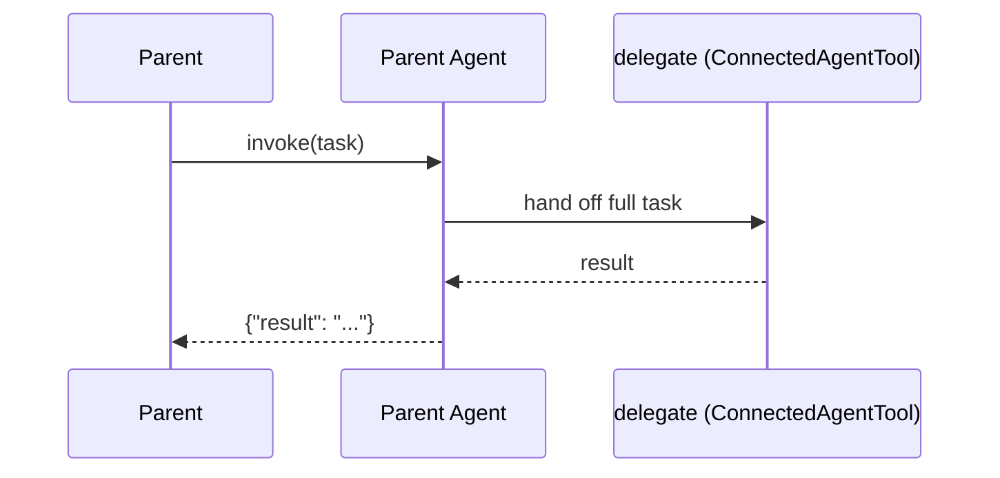

# Delegate — Direct Handoff

## Overview

The **delegate** role in `direct-handoff` receives the complete task from the parent agent and executes it in full. The parent has already decided that this sub-agent is the right one for the job; the delegate does not route or delegate further.

## Pattern Diagram



## Contract Specification

**Inputs**

| Field | Type   | Required | Description                        |
|-------|--------|----------|------------------------------------|
| task  | string | yes      | Full task text from parent agent   |

**Outputs**

| Field  | Type   | Required | Description                        |
|--------|--------|----------|------------------------------------|
| result | string | yes      | Completed result to return to parent |

## Azure Tools

| Tool       | Purpose                                |
|------------|----------------------------------------|
| iq-foundry | Knowledge retrieval for task execution |

## Usage

This role is used when a parent agent or route agent has decided — at LLM reasoning time — that the entire task should be handled by one specialist. The delegate executes the task and returns; it does not spawn further sub-agents.

To reference this handoff from a route agent:

```yaml
# In your route's agent definition
handoff_ref: my-direct-handoff
```
