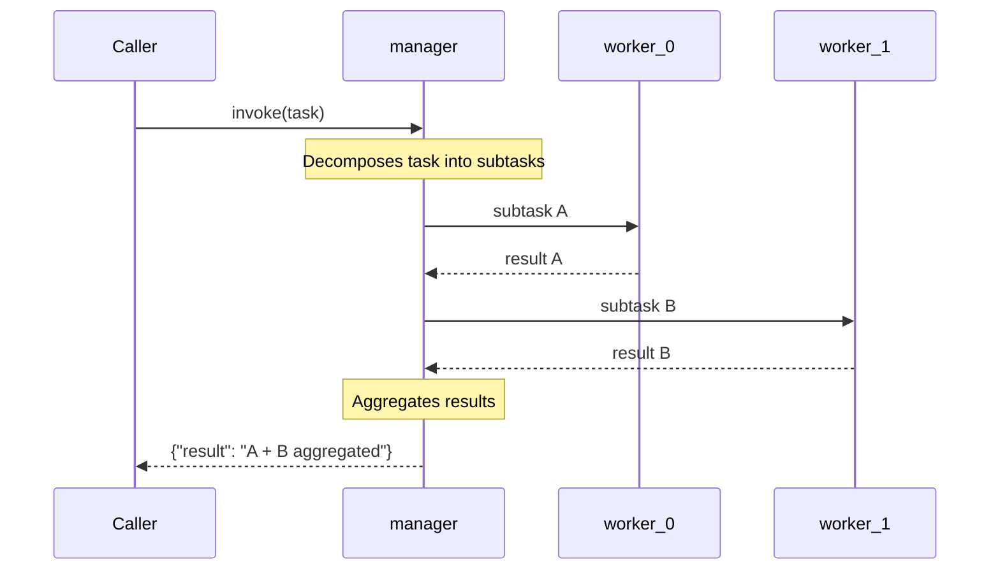

## Overview

The **manager** in `hierarchical-handoff` sits at the root (or an intermediate node) of the delegation tree. It decomposes the incoming task into subtasks, dispatches each subtask to a `worker_*` sub-agent, and aggregates results. Workers can themselves be managers in deeper hierarchies, up to `max_depth`.

## Pattern Diagram

## Contract Specification

**Inputs**

| Field | Type   | Required | Description                        |
|-------|--------|----------|------------------------------------|
| task  | string | yes      | Task to decompose and delegate     |

**Outputs**

| Field  | Type   | Required | Description                         |
|--------|--------|----------|-------------------------------------|
| result | string | yes      | Aggregated result from all workers  |

## Azure Tools

| Tool       | Purpose                                           |
|------------|---------------------------------------------------|
| iq-foundry | Task decomposition context and worker capability  |

## Usage

The manager is registered with all `worker_*` agents as ConnectedAgentTools. The manager's LLM decides at runtime which workers to invoke and in what order based on the task decomposition.
