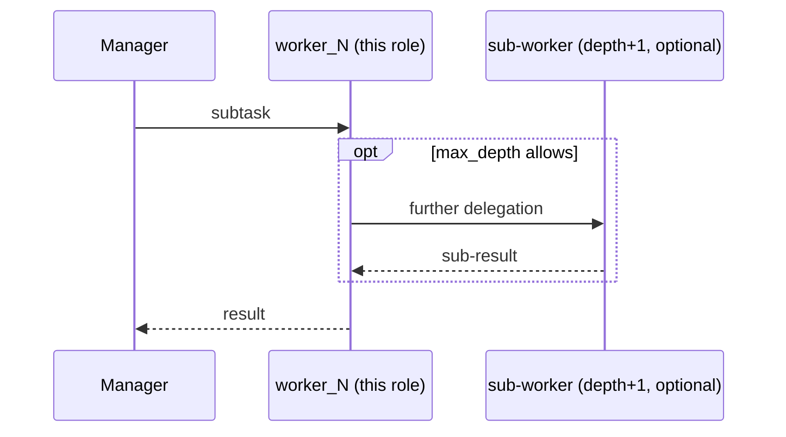

## Overview

A **worker** in `hierarchical-handoff` executes one subtask assigned by the manager. Workers are leaf nodes by default, but when `max_depth > 2`, a worker can itself act as a manager for deeper sub-workers.

## Pattern Diagram

## Contract Specification

**Inputs**

| Field | Type   | Required | Description                   |
|-------|--------|----------|-------------------------------|
| task  | string | yes      | Subtask delegated by manager  |

**Outputs**

| Field  | Type   | Required | Description                  |
|--------|--------|----------|------------------------------|
| result | string | yes      | Subtask result to manager    |

## Azure Tools

| Tool       | Purpose                              |
|------------|--------------------------------------|
| iq-foundry | Domain knowledge for subtask work    |

## Usage

Register multiple workers as `worker_0`, `worker_1`, etc. Each should have a distinct `description` so the manager's LLM can select the right worker for each subtask.
