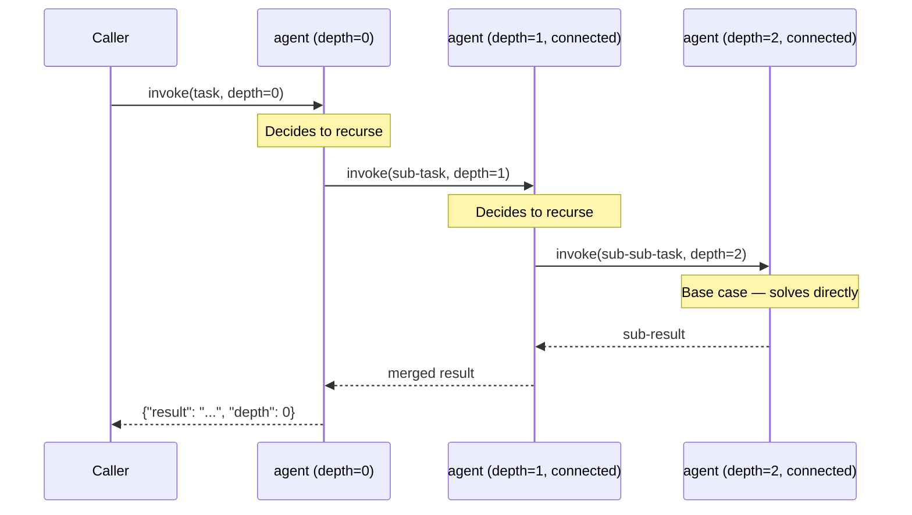

# Agent — Recursive Handoff

## Overview

The **agent** role in `recursive-handoff` is a self-similar agent connected to another instance of itself via ConnectedAgentTool. It processes the task directly if it determines no further breakdown is needed, or delegates a sub-problem to its connected sibling. Recursion is bounded by `max_depth`.

Ideal for tasks that are structurally self-similar: recursive document decomposition, tree traversal, divide-and-conquer reasoning, or hierarchical summarisation.

## Pattern Diagram

## Contract Specification

**Inputs**

| Field | Type   | Required | Description                          |
|-------|--------|----------|--------------------------------------|
| task  | string | yes      | Task or sub-task (may recurse)       |

**Outputs**

| Field  | Type   | Required | Description                          |
|--------|--------|----------|--------------------------------------|
| result | string | yes      | Result (self-solved or bubbled up)   |

## Azure Tools

| Tool       | Purpose                                        |
|------------|------------------------------------------------|
| iq-foundry | Knowledge retrieval for self-similar reasoning |

## Usage

Only one `agent` role is registered per `recursive-handoff` definition. The generated code connects the agent to a deployed instance of itself in Azure AI Foundry. Set `max_depth` conservatively (≤ 5) to avoid excessive token usage.
