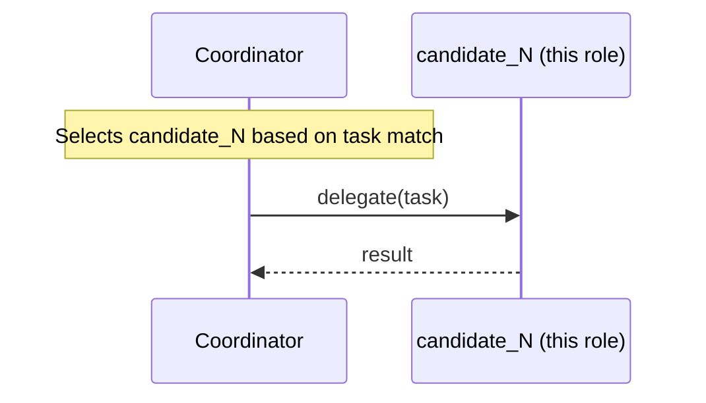

## Overview

A **candidate** in `selective-handoff` is one specialist sub-agent in the coordinator's pool. Candidates are registered as ConnectedAgentTools on the coordinator. Only the candidate whose description best matches the task at runtime will be invoked.

## Pattern Diagram

## Contract Specification

**Inputs**

| Field | Type   | Required | Description                      |
|-------|--------|----------|----------------------------------|
| task  | string | yes      | Task delegated by the coordinator |

**Outputs**

| Field  | Type   | Required | Description         |
|--------|--------|----------|---------------------|
| result | string | yes      | Specialist result   |

## Azure Tools

| Tool       | Purpose                                     |
|------------|---------------------------------------------|
| iq-foundry | Domain knowledge retrieval for the specialty |

## Usage

Register multiple instances of this role as `candidate_0`, `candidate_1`, etc. in your `HandoffDefinition`. Each candidate should have a distinct, descriptive `description` field — the coordinator uses these descriptions to decide which candidate to invoke.
