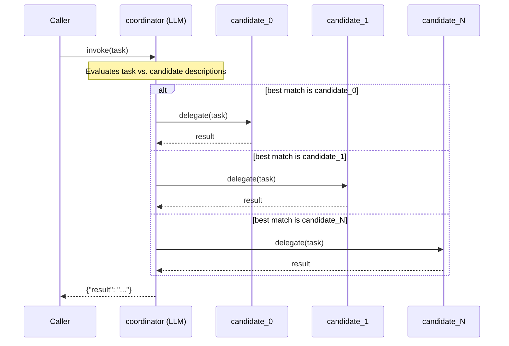

## Overview

The **coordinator** role in `selective-handoff` evaluates the incoming task and delegates it to exactly one of the registered candidate sub-agents. The selection is made by the coordinator's LLM at runtime based on the task content and the candidate descriptions provided as ConnectedAgentTool metadata.

## Pattern Diagram

## Contract Specification

**Inputs**

| Field | Type   | Required | Description           |
|-------|--------|----------|-----------------------|
| task  | string | yes      | Task to evaluate      |

**Outputs**

| Field  | Type   | Required | Description                     |
|--------|--------|----------|---------------------------------|
| result | string | yes      | Selected candidate's result     |

## Azure Tools

| Tool       | Purpose                                        |
|------------|------------------------------------------------|
| iq-foundry | Capability profiles to aid selection reasoning |

## Usage

Pair the coordinator with at least 2 `candidate_*` sub-agents in the `HandoffDefinition`. The coordinator receives all candidate tool definitions and picks exactly one to call.
