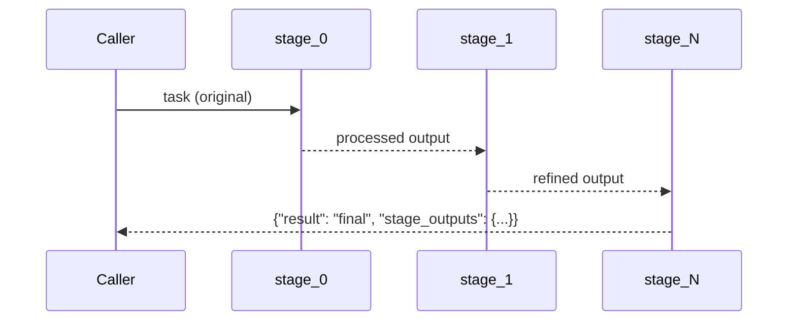

# Stage — Sequential Handoff

## Overview

A **stage** in `sequential-handoff` processes the previous stage's output and passes its result to the next stage. Unlike `sequential-pipeline` (which is statically wired), each stage here is a ConnectedAgentTool — the handoff between stages happens at runtime through the Azure AI Foundry agent framework.

## Pattern Diagram

## Contract Specification

**Inputs**

| Field | Type   | Required | Description                                  |
|-------|--------|----------|----------------------------------------------|
| task  | string | yes      | Previous stage output or original task input |

**Outputs**

| Field  | Type   | Required | Description                        |
|--------|--------|----------|------------------------------------|
| result | string | yes      | Processed output for the next stage |

## Azure Tools

| Tool       | Purpose                            |
|------------|------------------------------------|
| iq-foundry | Stage-specific knowledge retrieval |

## Usage

Register multiple stages as `stage_0`, `stage_1`, etc. in your `HandoffDefinition`. The generated code invokes them in sorted key order. Each stage can optionally use its own ConnectedAgentTool to sub-delegate within the stage.
