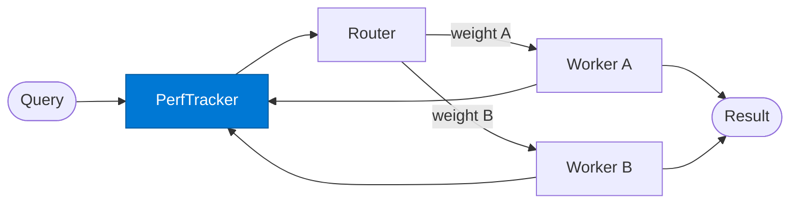

# Performance Tracker

_Tracks quality and cost per worker per input type and provides updated routing weights._

## Overview

The Performance Tracker is the **performance_tracker** role in the **adaptive-routing** pattern — tracks which agent performs best for each input type over time and updates routing weights dynamically. A self-improving dispatch layer.

## Pattern Diagram



## Contract Specification

### Inputs
**input_type** (string, required): Category of the input (e.g. 'support', 'finance')  
**action** (string, required): 'get_weights' | 'update_weights'  
**worker_key** (string, optional): Worker to update (update_weights only)  
**result** (object, optional): Execution result to score (update_weights only)  


### Outputs
**weights** (object): Current routing weights per worker for this input_type  
**updated** (boolean): True if weights were updated  


## Azure Tools

| Tool ID | Display Name | Service | Purpose in this role |
|---|---|---|---|
| `safe-token-metrics` | SAFE Token Metrics | Granular per-request token cost tracking | Track quality and cost per agent per input type via Token Metrics API |


## Usage

```python
from safe_framework.safe_core.code_generator import RouteCodeGenerator
from safe_framework.safe_core.models import RouteDefinition, RoutePattern, Agent

route = RouteDefinition(
    name="my-route",
    pattern=RoutePattern.ADAPTIVE_ROUTING,
    agents={"performance_tracker": Agent(
        name="Performance Tracker",
        category="test",
        version="1.0",
        input_schema={"type": "object", "properties": {}},
        output_schema={"type": "object", "properties": {}},
    )},
    description="Example route using this role",
)
generated = RouteCodeGenerator.generate(route)
```

## Use Cases

1. **Performance-based routing**
2. **A/B routing**
3. **Continuous routing improvement**


## Limitations

- Weight convergence requires sufficient request volume — results are noisy with few samples
- Weights are stored per `input_type`; very granular categories require more data to converge

## Related Roles

- **Performance Tracker** maintains state → **Router** selects → **Worker** executes → tracker updates
- See also: `budget-aware-routing` for cost-driven (not performance-driven) routing

---

**Status:** Production Ready  
**Version:** 1.0  
**Framework:** SAFE 1.0  
**Last Updated:** 2026-06-21
