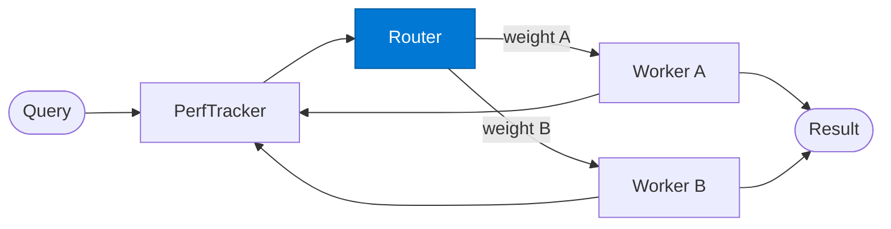

# Adaptive Router

_Selects the worker with the highest weight for the current input type._

## Overview

The Adaptive Router is the **router** role in the **adaptive-routing** pattern — tracks which agent performs best for each input type over time and updates routing weights dynamically. A self-improving dispatch layer.

## Pattern Diagram



## Contract Specification

### Inputs
**input_type** (string, required): Category of the current query  
**weights** (object, required): Worker weights from the performance tracker  


### Outputs
**selected_worker** (string): Worker key with the highest weight  
**weight_used** (float): Weight of the selected worker  
**routing_reason** (string): Why this worker was selected  


## Azure Tools

| Tool ID | Display Name | Service | Purpose in this role |
|---|---|---|---|
| `iq-foundry` | Foundry IQ | Indexed org knowledge via Azure AI Search | Retrieve and update routing weights from the knowledge store |


## Usage

```python
from safe_framework.safe_core.code_generator import RouteCodeGenerator
from safe_framework.safe_core.models import RouteDefinition, RoutePattern, Agent

route = RouteDefinition(
    name="my-route",
    pattern=RoutePattern.ADAPTIVE_ROUTING,
    agents={"router": Agent(
        name="Router",
        category="test",
        version="1.0",
        input_schema={"type": "object", "properties": {}},
        output_schema={"type": "object", "properties": {}},
    )},
    description="Example route using this role",
)
generated = RouteCodeGenerator.generate(route)
```

## Use Cases

1. **Best-worker selection**
2. **Traffic shaping**
3. **Gradual model migration**


## Limitations

- Weight convergence requires sufficient request volume — results are noisy with few samples
- Weights are stored per `input_type`; very granular categories require more data to converge

## Related Roles

- **Performance Tracker** maintains state → **Router** selects → **Worker** executes → tracker updates
- See also: `budget-aware-routing` for cost-driven (not performance-driven) routing

---

**Status:** Production Ready  
**Version:** 1.0  
**Framework:** SAFE 1.0  
**Last Updated:** 2026-06-21
