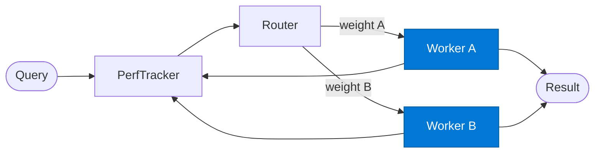

# Adaptive Worker

_Executes the request; its outcome is fed back to the performance tracker to update routing weights._

## Overview

The Adaptive Worker is the **worker** role in the **adaptive-routing** pattern — tracks which agent performs best for each input type over time and updates routing weights dynamically. A self-improving dispatch layer.

## Pattern Diagram



## Contract Specification

### Inputs
**query** (string, required): The query or task to process  
**input_type** (string, required): Input type category for context  


### Outputs
**result** (object): Worker output  
**quality_score** (float): Self-assessed or rubric quality score 0.0–1.0  
**latency_ms** (integer): Processing time in milliseconds  


## Azure Tools

| Tool ID | Display Name | Service | Purpose in this role |
|---|---|---|---|
| `iq-foundry` | Foundry IQ | Indexed org knowledge via Azure AI Search | Ground worker execution in org knowledge for the input type |


## Usage

```python
from safe_framework.safe_core.code_generator import RouteCodeGenerator
from safe_framework.safe_core.models import RouteDefinition, RoutePattern, Agent

route = RouteDefinition(
    name="my-route",
    pattern=RoutePattern.ADAPTIVE_ROUTING,
    agents={"worker": Agent(
        name="Worker",
        category="test",
        version="1.0",
        input_schema={"type": "object", "properties": {}},
        output_schema={"type": "object", "properties": {}},
    )},
    description="Example route using this role",
)
generated = RouteCodeGenerator.generate(route)
```

## Use Cases

1. **Specialised model A vs. model B trial**
2. **Version upgrade gradual rollout**
3. **Regional worker comparison**


## Limitations

- Weight convergence requires sufficient request volume — results are noisy with few samples
- Weights are stored per `input_type`; very granular categories require more data to converge

## Related Roles

- **Performance Tracker** maintains state → **Router** selects → **Worker** executes → tracker updates
- See also: `budget-aware-routing` for cost-driven (not performance-driven) routing

---

**Status:** Production Ready  
**Version:** 1.0  
**Framework:** SAFE 1.0  
**Last Updated:** 2026-06-21
