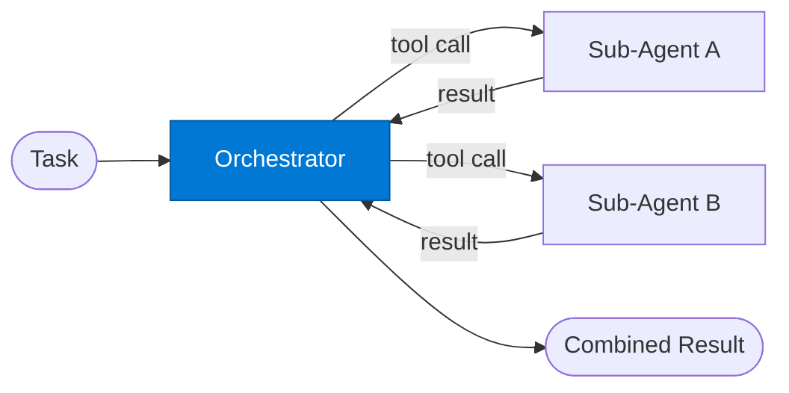

# Tool Orchestrator

_Plans which sub-agents to call as tools and combines their results._

## Overview

The Tool Orchestrator is the **orchestrator** role in the **agent-as-a-tool** pattern — specialised sub-agents are exposed as callable tools to a parent orchestrator, enabling composable multi-agent systems.

## Pattern Diagram



## Contract Specification

### Inputs
**task** (string, required): High-level task to accomplish using sub-agents  
**available_tools** (array, optional): List of available sub-agent tool IDs  


### Outputs
**tool_calls** (array): Planned sub-agent calls — each with agent_key and input  
**tool_results** (object): Results from each tool call keyed by call_id  


## Azure Tools

Orchestrator has no direct tool connections — it calls sub-agents.


## Usage

```python
from safe_framework.safe_core.code_generator import RouteCodeGenerator
from safe_framework.safe_core.models import RouteDefinition, RoutePattern, Agent

route = RouteDefinition(
    name="my-route",
    pattern=RoutePattern.AGENT_AS_A_TOOL,
    agents={"orchestrator": Agent(
        name="Orchestrator",
        category="test",
        version="1.0",
        input_schema={"type": "object", "properties": {}},
        output_schema={"type": "object", "properties": {}},
    )},
    description="Example route using this role",
)
generated = RouteCodeGenerator.generate(route)
```

## Use Cases

1. **Multi-tool research**
2. **Composite data pipeline**
3. **Autonomous task completion**


## Limitations

- Sub-agents must have deterministic, well-typed contracts to be reliable tools
- Recursive tool calling (sub-agent calling another sub-agent) is not supported in this pattern

## Related Roles

- **Orchestrator** decides which tools to call → **Sub-Agent** executes
- See also: `orchestrator-workers` for dynamic subtask decomposition without tool-call protocol

---

**Status:** Production Ready  
**Version:** 1.0  
**Framework:** SAFE 1.0  
**Last Updated:** 2026-06-21
