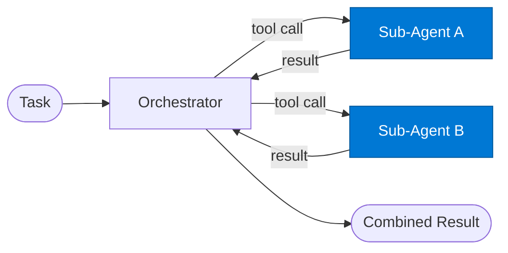

# Sub-Agent Tool

_A specialised agent exposed as a callable tool to the orchestrator._

## Overview

The Sub-Agent Tool is the **sub_agent** role in the **agent-as-a-tool** pattern — specialised sub-agents are exposed as callable tools to a parent orchestrator, enabling composable multi-agent systems.

## Pattern Diagram

## Contract Specification

### Inputs
**input** (object, required): Tool-specific input from the orchestrator  
**tool_id** (string, optional): This tool's registered ID  

### Outputs
**result** (object): Tool output  
**tool_id** (string): Echo of tool ID for orchestrator correlation  

## Azure Tools

| Tool ID | Display Name | Service | Purpose in this role |
|---|---|---|---|
| `iq-foundry` | Foundry IQ | Indexed org knowledge via Azure AI Search | Ground sub-agent execution in org knowledge |
| `iq-fabric` | Fabric IQ | OneLake, Power BI semantic models and datasets | Sub-agent accesses structured business data |
| `iq-web` | Web IQ | Live public web and news via Bing grounding | Sub-agent performs web research |

## Use Cases

1. **Summariser tool**
2. **Classifier tool**
3. **Data-fetch tool**

## Limitations

- Sub-agents must have deterministic, well-typed contracts to be reliable tools
- Recursive tool calling (sub-agent calling another sub-agent) is not supported in this pattern

## Related Roles

- **Orchestrator** decides which tools to call → **Sub-Agent** executes
- See also: `orchestrator-workers` for dynamic subtask decomposition without tool-call protocol

---

**Status:** Production Ready  
**Version:** 1.0  
**Framework:** SAFE 1.0  
**Last Updated:** 2026-06-21
