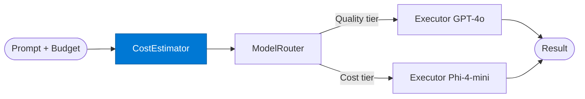

# Cost Estimator

_Estimates token cost for a request before routing to select the optimal model tier._

## Overview

The Cost Estimator is the **cost_estimator** role in the **budget-aware-routing** pattern — routes requests to a cheaper/faster model for simple queries and reserves expensive models for complex ones. Azure AI Foundry has a native Model Router purpose-built for this.

## Pattern Diagram

## Contract Specification

### Inputs
**prompt** (string, required): The prompt to cost-estimate  
**budget_usd** (float, required): Available budget in USD  

### Outputs
**estimated_cost_usd** (float): Estimated cost at each model tier  
**complexity** (string): 'simple' | 'medium' | 'complex' based on prompt analysis  
**recommended_tier** (string): 'Quality' | 'Cost' | 'Balanced'  

## Azure Tools

| Tool ID | Display Name | Service | Purpose in this role |
|---|---|---|---|
| `safe-token-metrics` | SAFE Token Metrics | Granular per-request token cost tracking | Granular per-request cost history for accurate estimation |

## Use Cases

1. **Pre-flight cost check**
2. **Budget enforcement**
3. **Model tier pre-selection**

## Limitations

- Cost estimation is approximate — actual cost may differ from estimate by ±20%
- Model Router requires `FOUNDRY_ENDPOINT` and `FOUNDRY_API_KEY` environment variables

## Related Roles

- **Cost Estimator** → **Model Router** → **Executor** is the cost-aware routing chain
- See also: `adaptive-routing` for performance-history-based routing (not purely cost-driven)

---

**Status:** Production Ready  
**Version:** 1.0  
**Framework:** SAFE 1.0  
**Last Updated:** 2026-06-21
