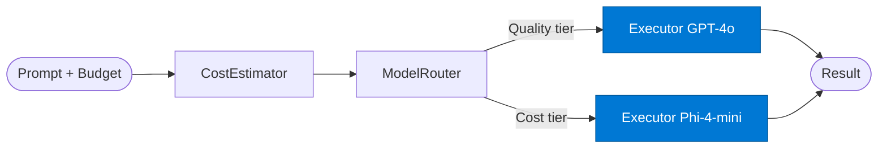

# Budget Executor

_Executes the LLM request using the model tier selected by the router._

## Overview

The Budget Executor is the **executor** role in the **budget-aware-routing** pattern — routes requests to a cheaper/faster model for simple queries and reserves expensive models for complex ones. Azure AI Foundry has a native Model Router purpose-built for this.

## Pattern Diagram



## Contract Specification

### Inputs
**prompt** (string, required): The prompt to execute  
**model_tier** (string, required): Model tier from router — 'Quality' | 'Cost' | 'Balanced'  


### Outputs
**result** (string): Model response  
**actual_cost_usd** (float): Actual token cost incurred  
**model_used** (string): Model deployment that executed the request  


## Azure Tools

No external tools — model execution only.


## Usage

```python
from safe_framework.safe_core.code_generator import RouteCodeGenerator
from safe_framework.safe_core.models import RouteDefinition, RoutePattern, Agent

route = RouteDefinition(
    name="my-route",
    pattern=RoutePattern.BUDGET_AWARE_ROUTING,
    agents={"executor": Agent(
        name="Executor",
        category="test",
        version="1.0",
        input_schema={"type": "object", "properties": {}},
        output_schema={"type": "object", "properties": {}},
    )},
    description="Example route using this role",
)
generated = RouteCodeGenerator.generate(route)
```

## Use Cases

1. **Quality-tier report generation**
2. **Cost-tier bulk classification**
3. **Balanced-tier analysis**


## Limitations

- Cost estimation is approximate — actual cost may differ from estimate by ±20%
- Model Router requires `FOUNDRY_ENDPOINT` and `FOUNDRY_API_KEY` environment variables

## Related Roles

- **Cost Estimator** → **Model Router** → **Executor** is the cost-aware routing chain
- See also: `adaptive-routing` for performance-history-based routing (not purely cost-driven)

---

**Status:** Production Ready  
**Version:** 1.0  
**Framework:** SAFE 1.0  
**Last Updated:** 2026-06-21
