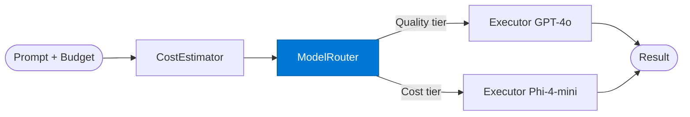

# Model Router

_Routes the LLM call to the optimal model tier (Quality / Cost / Balanced) based on budget and complexity._

## Overview

The Model Router is the **model_router** role in the **budget-aware-routing** pattern — routes requests to a cheaper/faster model for simple queries and reserves expensive models for complex ones. Azure AI Foundry has a native Model Router purpose-built for this.

## Pattern Diagram

## Contract Specification

### Inputs
**prompt** (string, required): The prompt to route  
**estimated_cost_usd** (float, required): From cost estimator  
**budget_usd** (float, required): Available budget  
**complexity** (string, required): Prompt complexity from estimator  

### Outputs
**model_tier** (string): 'Quality' | 'Cost' | 'Balanced'  
**model_id** (string): Specific model deployment selected  
**routing_reason** (string): Why this tier was selected  

## Azure Tools

| Tool ID | Display Name | Service | Purpose in this role |
|---|---|---|---|
| `safe-model-router` | SAFE Model Router | Route LLM calls by Quality / Cost / Balanced policy | Azure AI Foundry Model Router — Quality/Cost/Balanced policy |

## Use Cases

1. **Cost-aware inference**
2. **Budget enforcement**
3. **Latency vs. quality trade-off**

## Limitations

- Cost estimation is approximate — actual cost may differ from estimate by ±20%
- Model Router requires `FOUNDRY_ENDPOINT` and `FOUNDRY_API_KEY` environment variables

## Related Roles

- **Cost Estimator** → **Model Router** → **Executor** is the cost-aware routing chain
- See also: `adaptive-routing` for performance-history-based routing (not purely cost-driven)

---

**Status:** Production Ready  
**Version:** 1.0  
**Framework:** SAFE 1.0  
**Last Updated:** 2026-06-21
