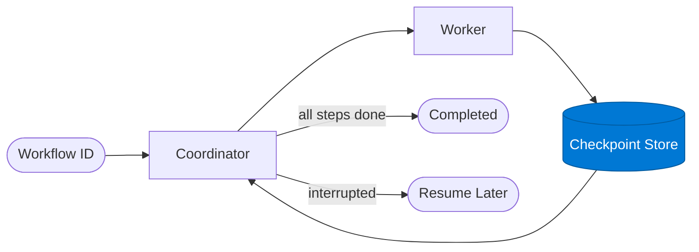

# Checkpoint Store

_Persists step results as durable checkpoints so the workflow can resume after interruption._

## Overview

The Checkpoint Store is the **checkpoint_store** role in the **checkpoint-resume** pattern — workflows save state at each stage so they can pause, be inspected, and resume without re-running completed work. Critical for long or expensive pipelines.

## Pattern Diagram

## Contract Specification

### Inputs
**workflow_id** (string, required): Workflow identifier  
**step_id** (string, required): Step that just completed  
**result** (object, required): Step result to persist  
**action** (string, required): 'checkpoint' | 'get_state'  

### Outputs
**checkpoint_id** (string): Stored checkpoint document ID  
**persisted_at** (string): ISO 8601 timestamp  

## Azure Tools

| Tool ID | Display Name | Service | Purpose in this role |
|---|---|---|---|
| `safe-durable-task` | SAFE Durable Task | Checkpoint / suspend / resume long-running workflows | Azure Durable Task — durable storage backend (Storage / Cosmos / MSSQL) |

## Use Cases

1. **State persistence between steps**
2. **Crash-safe workflow execution**
3. **Long-running pipeline checkpoint**

## Limitations

- Requires SAFE Durable Task MCP server configured with `DURABLE_TASK_ENDPOINT` and `DURABLE_TASK_KEY`
- Steps must be idempotent — they may be re-executed after recovery

## Related Roles

- **Coordinator** manages the step graph → **Worker** executes → **Checkpoint Store** persists
- See also: `human-in-the-loop` for workflows that pause for a human decision

---

**Status:** Production Ready  
**Version:** 1.0  
**Framework:** SAFE 1.0  
**Last Updated:** 2026-06-21
