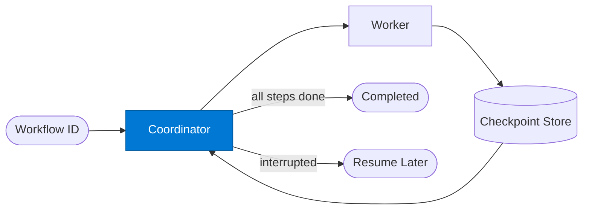

# Checkpoint Coordinator

_Manages the workflow step graph, tracks progress, and coordinates start/resume/finalise transitions._

## Overview

The Checkpoint Coordinator is the **coordinator** role in the **checkpoint-resume** pattern — workflows save state at each stage so they can pause, be inspected, and resume without re-running completed work. Critical for long or expensive pipelines.

## Pattern Diagram

## Contract Specification

### Inputs
**workflow_id** (string, required): Unique workflow instance identifier  
**action** (string, required): 'start_or_resume' | 'finalise'  
**payload** (object, optional): Workflow input (required for start)  

### Outputs
**workflow_id** (string): Echo of workflow ID  
**status** (string): 'running' | 'completed' | 'suspended'  
**completed_steps** (array): Steps already done  
**pending_steps** (array): Steps still to execute  

## Azure Tools

| Tool ID | Display Name | Service | Purpose in this role |
|---|---|---|---|
| `safe-durable-task` | SAFE Durable Task | Checkpoint / suspend / resume long-running workflows | Manages step graph, checkpoints every state transition |

## Use Cases

1. **Long-running ETL coordination**
2. **Multi-day approval workflow**
3. **Resumable data pipeline**

## Limitations

- Requires SAFE Durable Task MCP server configured with `DURABLE_TASK_ENDPOINT` and `DURABLE_TASK_KEY`
- Steps must be idempotent — they may be re-executed after recovery

## Related Roles

- **Coordinator** manages the step graph → **Worker** executes → **Checkpoint Store** persists
- See also: `human-in-the-loop` for workflows that pause for a human decision

---

**Status:** Production Ready  
**Version:** 1.0  
**Framework:** SAFE 1.0  
**Last Updated:** 2026-06-21
