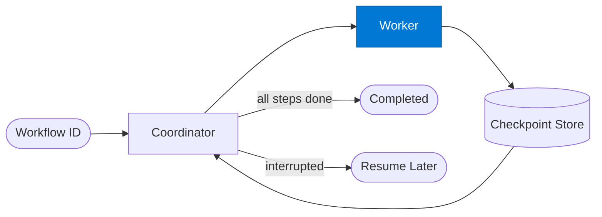

# Checkpoint Worker

_Executes a single workflow step; its result is immediately checkpointed after completion._

## Overview

The Checkpoint Worker is the **worker** role in the **checkpoint-resume** pattern — workflows save state at each stage so they can pause, be inspected, and resume without re-running completed work. Critical for long or expensive pipelines.

## Pattern Diagram

## Contract Specification

### Inputs
**step** (object, required): Step definition — id, action, inputs  
**workflow_id** (string, required): Parent workflow identifier  

### Outputs
**step_id** (string): Echo of step ID  
**output** (object): Step output  
**success** (boolean): Whether the step completed successfully  

## Azure Tools

| Tool ID | Display Name | Service | Purpose in this role |
|---|---|---|---|
| `iq-foundry` | Foundry IQ | Indexed org knowledge via Azure AI Search | Ground step execution in org knowledge |
| `iq-fabric` | Fabric IQ | OneLake, Power BI semantic models and datasets | Execute data-oriented steps against OneLake |

## Use Cases

1. **Data transformation step**
2. **Document generation step**
3. **API call step**

## Limitations

- Requires SAFE Durable Task MCP server configured with `DURABLE_TASK_ENDPOINT` and `DURABLE_TASK_KEY`
- Steps must be idempotent — they may be re-executed after recovery

## Related Roles

- **Coordinator** manages the step graph → **Worker** executes → **Checkpoint Store** persists
- See also: `human-in-the-loop` for workflows that pause for a human decision

---

**Status:** Production Ready  
**Version:** 1.0  
**Framework:** SAFE 1.0  
**Last Updated:** 2026-06-21
