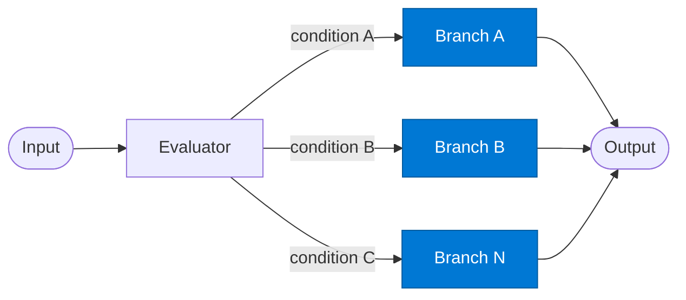

# Branch Agent

_Executes one specific processing path when its condition is matched._

## Overview

The Branch agent represents a single conditional path in the **conditional-branching** pattern. It is invoked only when the Evaluator selects its branch key. Multiple branch agents are registered in the route — only one runs per request. Each branch can have its own tools, prompts, and output schema.

## Pattern Diagram



## Contract Specification

### Inputs

**branch_decision** (object, required):
- `branch` (string): Must match this branch's registered key
- `payload` (any, required): The data to process
- `matched_condition` (string): Which condition triggered this branch

### Outputs

**branch_result** (object):
- `branch` (string): Echo of input branch key
- `result` (any, required): This branch's output
- `status` (string): `"success"` | `"error"`

## Azure Tools

| Tool ID | Display Name | Service | Purpose in this role |
|---|---|---|---|
| `iq-foundry` | Foundry IQ | Indexed org knowledge via Azure AI Search | Branch-specific knowledge index per execution path |
| `iq-web` | Web IQ | Live public web and news via Bing grounding | For branches that need live external information |

## Usage

```python
from safe_framework.agents.patterns.conditional_branching.branch import BranchAgent

# Register multiple branch agents — route will invoke the correct one
high_value_branch = BranchAgent(kernel=kernel, branch_key="high_value_contract")
result = await high_value_branch.invoke(branch_decision)
```

## Use Cases

1. **High-value contract branch** — full legal + compliance review pipeline
2. **Standard contract branch** — automated template-matching only
3. **Escalation branch** — notify a human approver and pause the workflow
4. **Express branch** — fast-path for pre-approved low-risk requests

## Limitations

- Each branch must be registered in the route config — unregistered branches cause a routing error
- Branches cannot trigger other branches — for multi-stage conditional logic, chain routes

## Related Roles

- **Evaluator** — selects which branch to invoke
- See also: `fallback-chain` for sequential fallback instead of single-branch selection

---

**Status:** Production Ready  
**Version:** 1.0  
**Framework:** SAFE 1.0  
**Last Updated:** 2026-06-21
