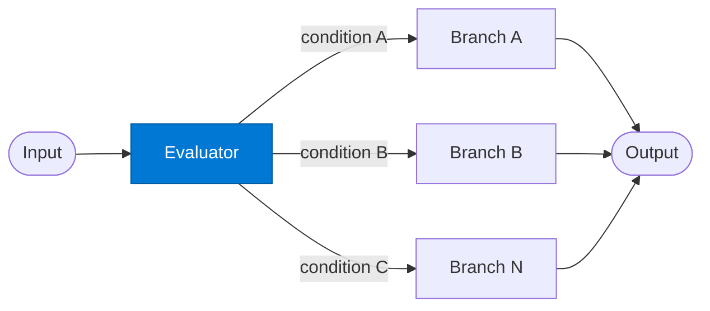

# Condition Evaluator

_Evaluates the incoming request against a set of conditions and selects the active branch._

## Overview

The Evaluator classifies the input against a defined set of conditions (e.g. `doc_type == "contract"`, `amount > 100000`, `priority == "critical"`) and returns the key of the branch that should execute. Only one branch executes per invocation — the evaluator's decision is final.

## Pattern Diagram



## Contract Specification

### Inputs

**request** (object, required):
- `payload` (any, required): Data to evaluate
- `conditions` (array, optional): Override the default condition set
- `context` (object, optional): Additional signals for condition evaluation

### Outputs

**branch_decision** (object):
- `branch` (string, required): Key of the selected branch (e.g. `"high_value"`)
- `confidence` (float): Confidence in the branch selection
- `matched_condition` (string): The condition expression that matched
- `payload` (any): Original payload forwarded to the branch

## Azure Tools

| Tool ID | Display Name | Service | Purpose in this role |
|---|---|---|---|
| `iq-foundry` | Foundry IQ | Indexed org knowledge via Azure AI Search | Retrieve classification rules and decision trees to evaluate conditions |
| `iq-work` | Work IQ | M365 signals — meetings, chats, emails, documents | Use org signals (requestor, team, history) as part of the condition |
| `iq-fabric` | Fabric IQ | OneLake, Power BI semantic models and datasets | Query business rules or thresholds directly from the semantic data model |

## Usage

```python
from safe_framework.agents.patterns.conditional_branching.evaluator import ConditionEvaluator

evaluator = ConditionEvaluator(kernel=kernel)
decision = await evaluator.invoke({
    "payload": {"doc_type": "contract", "value": 250000, "region": "EMEA"}
})
# decision["branch"] → "high_value_contract"
```

## Use Cases

1. **Document routing** — route contracts, invoices, and reports to different processing branches
2. **Risk tiering** — route low/medium/high risk transactions to different approval workflows
3. **Geographic routing** — apply region-specific rules based on the request origin
4. **Priority handling** — fast-track critical requests to a dedicated branch

## Limitations

- Only one branch executes — use `mixture-of-experts` for cases requiring multiple simultaneous paths
- Condition evaluation is deterministic; stochastic branching is not supported
- `confidence` below a configured threshold should trigger a default/fallback branch

## Related Roles

- **Branch** — executes the selected path; receives this role's `branch_decision`

---

**Status:** Production Ready  
**Version:** 1.0  
**Framework:** SAFE 1.0  
**Last Updated:** 2026-06-21
