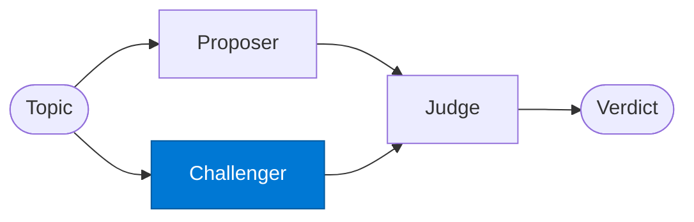

# Debate Challenger

_Argues the opposing position, exposing weaknesses in the proposer's argument._

## Overview

The Debate Challenger is the **challenger** role in the **debate** pattern. Two agents argue opposing positions; a judge synthesises the best answer — surfaces edge cases and reduces single-agent bias in risk or investment analysis.

## Pattern Diagram

## Contract Specification

### Inputs
**topic** (string, required): The topic or question to debate  
**opposing_position** (object, required): The proposer's argument to challenge  

### Outputs
**position** (string): The challenger's argued position  
**evidence** (array): Counter-evidence and sources  
**strength** (float): Self-assessed argument strength 0.0–1.0  

## Azure Tools

| Tool ID | Display Name | Service | Purpose in this role |
|---|---|---|---|
| `iq-foundry` | Foundry IQ | Indexed org knowledge via Azure AI Search | Retrieve internal evidence supporting position B |
| `iq-web` | Web IQ | Live public web and news via Bing grounding | Gather external evidence supporting position B |

## Use Cases

1. **Investment case against**
2. **Risk analysis — downside**
3. **Devil's advocate**

## Limitations

- Both proposer and challenger are positionally biased by design — the judge must remain impartial
- Token usage is ~3× a single-agent analysis — reserve for high-stakes decisions

## Related Roles

- **Proposer** + **Challenger** → **Judge** is the argument → synthesis chain
- See also: `self-consistency` for N identical attempts rather than two opposing positions

---

**Status:** Production Ready  
**Version:** 1.0  
**Framework:** SAFE 1.0  
**Last Updated:** 2026-06-21
