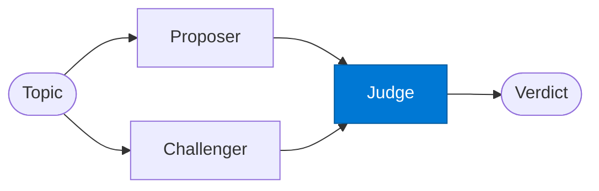

# Debate Judge

_Evaluates both positions impartially and synthesises the most defensible verdict._

## Overview

The Debate Judge is the **judge** role in the **debate** pattern. Two agents argue opposing positions; a judge synthesises the best answer — surfaces edge cases and reduces single-agent bias in risk or investment analysis.

## Pattern Diagram



## Contract Specification

### Inputs
**topic** (string, required): The original debate topic  
**proposal** (object, required): Proposer's argument  
**challenge** (object, required): Challenger's argument  


### Outputs
**verdict** (string): The judge's conclusion  
**reasoning** (string): Reasoning for the verdict  
**stronger_side** (string): 'proposer' | 'challenger' | 'tie'  
**recommendations** (array): Actionable recommendations  


## Azure Tools

| Tool ID | Display Name | Service | Purpose in this role |
|---|---|---|---|
| `iq-work` | Work IQ | M365 signals — meetings, chats, emails, documents | Apply org policy context and past decisions to the verdict |


## Usage

```python
from safe_framework.safe_core.code_generator import RouteCodeGenerator
from safe_framework.safe_core.models import RouteDefinition, RoutePattern, Agent

route = RouteDefinition(
    name="my-route",
    pattern=RoutePattern.DEBATE,
    agents={"judge": Agent(
        name="Judge",
        category="test",
        version="1.0",
        input_schema={"type": "object", "properties": {}},
        output_schema={"type": "object", "properties": {}},
    )},
    description="Example route using this role",
)
generated = RouteCodeGenerator.generate(route)
```

## Use Cases

1. **Go/no-go investment decision**
2. **Risk vs. opportunity summary**
3. **Balanced policy brief**


## Limitations

- Both proposer and challenger are positionally biased by design — the judge must remain impartial
- Token usage is ~3× a single-agent analysis — reserve for high-stakes decisions

## Related Roles

- **Proposer** + **Challenger** → **Judge** is the argument → synthesis chain
- See also: `self-consistency` for N identical attempts rather than two opposing positions

---

**Status:** Production Ready  
**Version:** 1.0  
**Framework:** SAFE 1.0  
**Last Updated:** 2026-06-21
