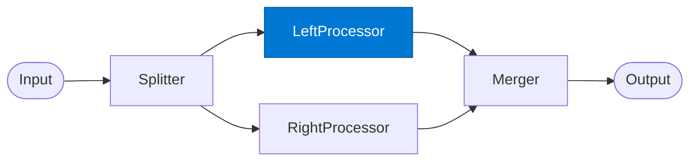

# Left Processor

_Analyses the input via the internal knowledge path._

## Overview

The Left Processor is one of two parallel paths in the **diamond** pattern. Conventionally it handles the internal/qualitative analysis path — consulting Foundry IQ for org knowledge and Fabric IQ for structured business data. It runs concurrently with the Right Processor.

## Pattern Diagram



## Contract Specification

### Inputs

**left_input** (any, required): The prepared payload from the Splitter.
**split_id** (string): Correlation ID.

### Outputs

**left_result** (object):
- `split_id` (string): Echo of input for merger correlation
- `path` (string): `"left"`
- `analysis` (object): The left path's findings
- `confidence` (float)

## Azure Tools

| Tool ID | Display Name | Service | Purpose in this role |
|---|---|---|---|
| `iq-foundry` | Foundry IQ | Indexed org knowledge via Azure AI Search | Internal knowledge analysis path |
| `iq-fabric` | Fabric IQ | OneLake, Power BI semantic models and datasets | Quantitative / analytical path using Power BI data |

## Usage

```python
from safe_framework.agents.patterns.diamond.left_processor import LeftProcessor

proc = LeftProcessor(kernel=kernel)
result = await proc.invoke({
    "left_input": financial_data,
    "split_id": "split-001"
})
```

## Use Cases

1. **Internal competitive analysis** — Foundry IQ retrieves past deal analyses and benchmarks
2. **Financial modelling** — Fabric IQ queries Power BI models for current KPIs
3. **Policy compliance** — checks input against internal policy index

## Limitations

- Runs in parallel with Right Processor — cannot consume Right Processor output
- Use `split_id` in all log messages for end-to-end traceability

## Related Roles

- **Splitter** — provides this role's input
- **Right Processor** — parallel counterpart
- **Merger** — combines left + right results

---

**Status:** Production Ready  
**Version:** 1.0  
**Framework:** SAFE 1.0  
**Last Updated:** 2026-06-21
