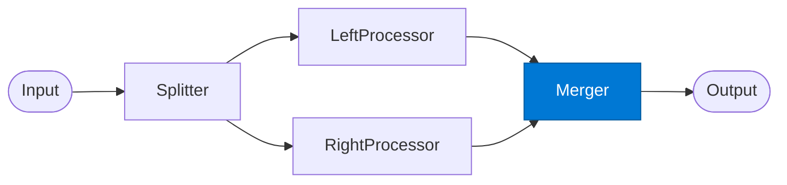

# Diamond Merger

_Combines left and right path results into a single synthesised output._

## Overview

The Merger is the reconvergence point of the **diamond** pattern. It waits for both parallel paths to complete, then synthesises their findings into a coherent result. It resolves contradictions, weights each path by confidence, and produces the canonical output.

## Pattern Diagram



## Contract Specification

### Inputs

**merge_inputs** (object, required):
- `left` (object): Left processor result — `{ "analysis": object, "confidence": float }`
- `right` (object): Right processor result — `{ "analysis": object, "confidence": float }`
- `split_id` (string): Correlation ID

### Outputs

**merged_result** (object):
- `synthesis` (object, required): Combined findings
- `left_weight` (float): Contribution weight of left path
- `right_weight` (float): Contribution weight of right path
- `conflicts` (array): Contradictions identified between paths (if any)
- `split_id` (string): Echo for traceability

## Azure Tools

| Tool ID | Display Name | Service | Purpose in this role |
|---|---|---|---|
| `iq-foundry` | Foundry IQ | Indexed org knowledge via Azure AI Search | Merge left + right results validated against business rules |

## Usage

```python
from safe_framework.agents.patterns.diamond.merger import DiamondMerger

merger = DiamondMerger(kernel=kernel)
result = await merger.invoke({
    "left": left_result,
    "right": right_result,
    "split_id": "split-001"
})
```

## Use Cases

1. **Balanced deal analysis** — merge internal financials with external market context
2. **Conflict surfacing** — flag where internal policy contradicts external regulations
3. **Dual-perspective reporting** — produce a report section from each path, then synthesise

## Limitations

- Cannot merge paths with incompatible schemas — Splitter must coordinate output formats
- Conflict resolution is LLM-based; review `conflicts` in sensitive scenarios

## Related Roles

- **Left Processor** / **Right Processor** — provide the two inputs this role merges
- **Splitter** — created the two paths now being reconverged

---

**Status:** Production Ready  
**Version:** 1.0  
**Framework:** SAFE 1.0  
**Last Updated:** 2026-06-21
