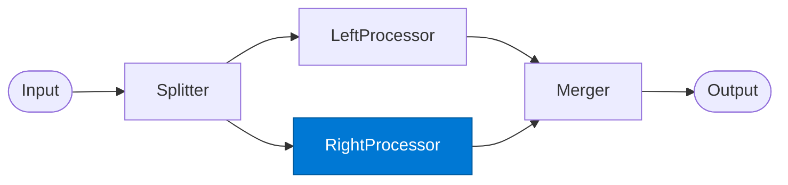

# Right Processor

_Analyses the input via the external or collaborative context path._

## Overview

The Right Processor is the second of two parallel paths in the **diamond** pattern. Conventionally it handles the external/contextual analysis — consulting Web IQ for market data or Work IQ for internal collaboration context. It runs concurrently with the Left Processor.

## Pattern Diagram



## Contract Specification

### Inputs

**right_input** (any, required): The prepared payload from the Splitter.
**split_id** (string): Correlation ID.

### Outputs

**right_result** (object):
- `split_id` (string): Echo for merger correlation
- `path` (string): `"right"`
- `analysis` (object): The right path's findings
- `confidence` (float)

## Azure Tools

| Tool ID | Display Name | Service | Purpose in this role |
|---|---|---|---|
| `iq-web` | Web IQ | Live public web and news via Bing grounding | External context / market data path via Bing grounding |
| `iq-work` | Work IQ | M365 signals — meetings, chats, emails, documents | Internal collaboration / people context path from M365 |

## Usage

```python
from safe_framework.agents.patterns.diamond.right_processor import RightProcessor

proc = RightProcessor(kernel=kernel)
result = await proc.invoke({
    "right_input": deal_context,
    "split_id": "split-001"
})
```

## Use Cases

1. **Market analysis** — Web IQ searches for competitor announcements and news
2. **Stakeholder context** — Work IQ retrieves past email threads about the deal
3. **Regulatory landscape** — public web search for recent regulatory changes

## Limitations

- Web IQ results may be outdated or incomplete — include `confidence` in output
- Use `split_id` consistently for end-to-end traceability

## Related Roles

- **Splitter** — provides this role's input
- **Left Processor** — parallel counterpart
- **Merger** — combines left + right results

---

**Status:** Production Ready  
**Version:** 1.0  
**Framework:** SAFE 1.0  
**Last Updated:** 2026-06-21
