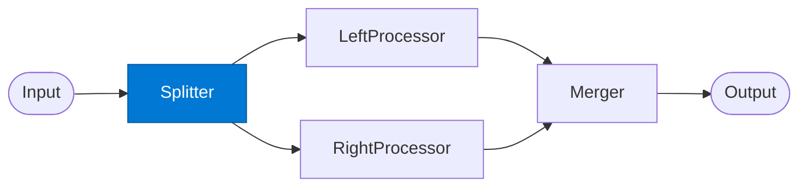

# Diamond Splitter

_Duplicates the input and dispatches it to two parallel processing paths._

## Overview

The Splitter is the entry point of the **diamond** pattern. Unlike the map-reduce splitter which partitions data, the diamond splitter sends the same (or a transformed copy of the) input to two independent processing paths — left and right — that run in parallel and reconverge at the Merger.

## Pattern Diagram



## Contract Specification

### Inputs

**input** (object, required):
- `payload` (any, required): The data to analyse
- `left_transform` (string, optional): How to prepare payload for the left path
- `right_transform` (string, optional): How to prepare payload for the right path

### Outputs

**split_output** (object):
- `left_input` (any): Payload prepared for the left processor
- `right_input` (any): Payload prepared for the right processor
- `split_id` (string): Correlation ID for the two paths

## Azure Tools

| Tool ID | Display Name | Service | Purpose in this role |
|---|---|---|---|
| `iq-fabric` | Fabric IQ | OneLake, Power BI semantic models and datasets | Split structured data from OneLake into left/right paths |
| `azure-cosmos-db` | Azure Cosmos DB | Vector + document store; hybrid search | Split from an operational database |

## Usage

```python
from safe_framework.agents.patterns.diamond.splitter import DiamondSplitter

splitter = DiamondSplitter(kernel=kernel)
split = await splitter.invoke({
    "payload": deal_document,
    "left_transform": "extract_financial_data",
    "right_transform": "extract_market_context"
})
```

## Use Cases

1. **Dual-perspective analysis** — internal knowledge path + external web path
2. **Quantitative / qualitative split** — structured data analysis + narrative analysis
3. **Risk / opportunity analysis** — one path finds risks, the other finds opportunities

## Limitations

- Both paths receive input from the same split; if the paths need disjoint data, pre-process before splitting
- Asymmetric path complexity causes the faster path to wait at the Merger

## Related Roles

- **Left Processor** / **Right Processor** — parallel paths receiving each split
- **Merger** — reconverges the two paths into a single result

---

**Status:** Production Ready  
**Version:** 1.0  
**Framework:** SAFE 1.0  
**Last Updated:** 2026-06-21
