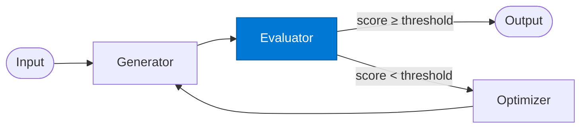

# EO Evaluator

_Scores the generator output against a quality rubric and returns feedback._

## Overview

The EO Evaluator is the **evaluator** role in the **evaluator-optimizer** pattern. It scores the draft and returns actionable feedback.

## Pattern Diagram



## Contract Specification

### Inputs
**output** (object, required): Generated output to evaluate  
**iteration** (integer, required): Current iteration number  


### Outputs
**quality_score** (float): Quality score 0.0–1.0  
**feedback** (object): Structured improvement feedback  
**passed** (boolean): True if score meets threshold  


## Azure Tools

| Tool ID | Display Name | Service | Purpose in this role |
|---|---|---|---|
| `iq-foundry` | Foundry IQ | Indexed org knowledge via Azure AI Search | Retrieve quality rubrics and standards |
| `iq-work` | Work IQ | M365 signals — meetings, chats, emails, documents | Compare against org-approved examples |

## Usage

```python
from safe_framework.agents.patterns.evaluator_optimizer.evaluator import EOEvaluator

agent = EOEvaluator(kernel=kernel)
result = await agent.invoke({{output: {}, iteration: 0}})
```

## Use Cases

1. **Compliance check**
2. **Quality gate for reports**
3. **Code review scoring**


## Limitations

- Quality threshold must be tuned per use-case
- Too-strict thresholds cause max-iteration exhaustion

## Related Roles

- **Generator** → **Evaluator** → **Optimizer** form the quality loop
- See also: `retry-loop` for failure-based retries without quality scoring

---

**Status:** Production Ready  
**Version:** 1.0  
**Framework:** SAFE 1.0  
**Last Updated:** 2026-06-21
