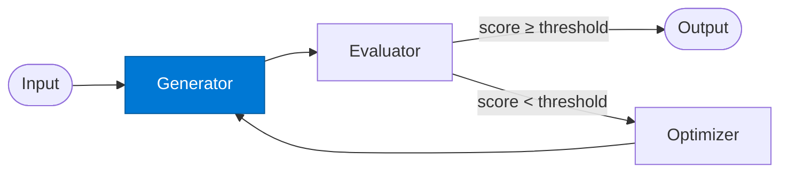

# EO Generator

_Produces the initial output draft for quality evaluation._

## Overview

The EO Generator is the **generator** role in the **evaluator-optimizer** pattern. It generates the initial draft.

## Pattern Diagram



## Contract Specification

### Inputs
**payload** (object, required): Task or content to generate  
**feedback** (object, optional): Optimizer feedback from previous iteration  


### Outputs
**output** (object): Generated output draft  
**metadata** (object): Generation metadata  


## Azure Tools

| Tool ID | Display Name | Service | Purpose in this role |
|---|---|---|---|
| `iq-foundry` | Foundry IQ | Indexed org knowledge via Azure AI Search | Ground first draft in org knowledge and standards |

## Usage

```python
from safe_framework.agents.patterns.evaluator_optimizer.generator import EOGenerator

agent = EOGenerator(kernel=kernel)
result = await agent.invoke({{task: 'draft contract clause'}})
```

## Use Cases

1. **Draft contract clauses**
2. **Generate report sections**
3. **Produce initial code**


## Limitations

- Quality threshold must be tuned per use-case
- Too-strict thresholds cause max-iteration exhaustion

## Related Roles

- **Generator** → **Evaluator** → **Optimizer** form the quality loop
- See also: `retry-loop` for failure-based retries without quality scoring

---

**Status:** Production Ready  
**Version:** 1.0  
**Framework:** SAFE 1.0  
**Last Updated:** 2026-06-21
