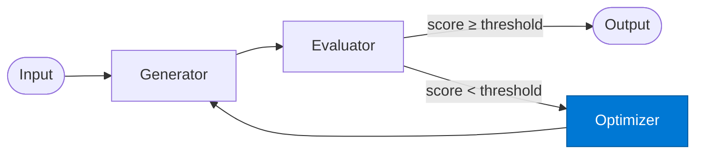

# EO Optimizer

_Refines the request or prompt based on evaluator feedback for the next generation attempt._

## Overview

The EO Optimizer is the **optimizer** role in the **evaluator-optimizer** pattern. It refines the request based on evaluator feedback so the next generation attempt improves.

## Pattern Diagram



## Contract Specification

### Inputs
**output** (object, required): Failed output from generator  
**feedback** (object, required): Evaluator feedback  
**iteration** (integer, required): Current iteration number  


### Outputs
**payload** (object): Improved request for the generator  
**changes** (array): List of changes made to the prompt  


## Azure Tools

No external tools required — pure LLM refinement.

## Usage

```python
from safe_framework.agents.patterns.evaluator_optimizer.optimizer import EOOptimizer

agent = EOOptimizer(kernel=kernel)
result = await agent.invoke({{output: {}, feedback: {}, iteration: 1}})
```

## Use Cases

1. **Prompt refinement**
2. **Instruction improvement**
3. **Constraint relaxation**


## Limitations

- Quality threshold must be tuned per use-case
- Too-strict thresholds cause max-iteration exhaustion

## Related Roles

- **Generator** → **Evaluator** → **Optimizer** form the quality loop
- See also: `retry-loop` for failure-based retries without quality scoring

---

**Status:** Production Ready  
**Version:** 1.0  
**Framework:** SAFE 1.0  
**Last Updated:** 2026-06-21
