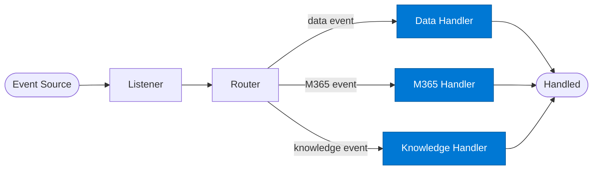

# Event Handler

_Processes a specific event type once routed by the event router._

## Overview

The Event Handler is the **handler** role in the **event-driven** pattern — agents triggered by events (webhook, queue message, file upload) rather than direct calls. Enables reactive, asynchronous enterprise integrations.

## Pattern Diagram

## Contract Specification

### Inputs
**event_type** (string, required): The event type this handler processes  
**payload** (object, required): Normalised event payload  
**event_id** (string, required): Event identifier for deduplication  

### Outputs
**handled** (boolean): Whether the event was successfully handled  
**result** (object): Handler output  
**event_id** (string): Echo for audit trail  

## Azure Tools

| Tool ID | Display Name | Service | Purpose in this role |
|---|---|---|---|
| `iq-fabric` | Fabric IQ | OneLake, Power BI semantic models and datasets | Data events — query and update OneLake / Fabric |
| `iq-work` | Work IQ | M365 signals — meetings, chats, emails, documents | M365 events — process Teams, Outlook, or SharePoint events |
| `iq-foundry` | Foundry IQ | Indexed org knowledge via Azure AI Search | Knowledge events — update or query the knowledge index |

## Use Cases

1. **Invoice processing**
2. **Document classification on upload**
3. **Calendar event processing**

## Limitations

- Event deduplication must be implemented using `event_id` — Service Bus / Event Hub provides at-least-once delivery
- Handler must be idempotent

## Related Roles

- **Listener** normalises → **Router** dispatches → **Handler** processes
- See also: `checkpoint-resume` for long-running event handlers that need state persistence

---

**Status:** Production Ready  
**Version:** 1.0  
**Framework:** SAFE 1.0  
**Last Updated:** 2026-06-21
