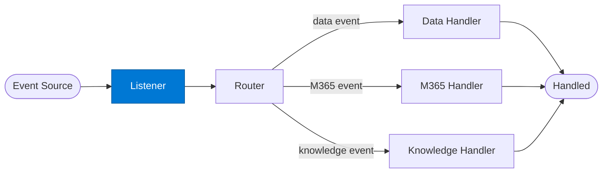

# Event Listener

_Receives and normalises incoming events from Azure Service Bus, Event Hub, or webhook triggers._

## Overview

The Event Listener is the **listener** role in the **event-driven** pattern — agents triggered by events (webhook, queue message, file upload) rather than direct calls. Enables reactive, asynchronous enterprise integrations.

## Pattern Diagram



## Contract Specification

### Inputs
**event_payload** (object, required): Raw event payload from the source  
**event_source** (string, optional): Source system identifier  


### Outputs
**event_type** (string): Normalised event type key  
**event_id** (string): Unique event identifier  
**payload** (object): Normalised event payload  
**received_at** (string): ISO 8601 timestamp  


## Azure Tools

No external tools — normalisation only.


## Usage

```python
from safe_framework.safe_core.code_generator import RouteCodeGenerator
from safe_framework.safe_core.models import RouteDefinition, RoutePattern, Agent

route = RouteDefinition(
    name="my-route",
    pattern=RoutePattern.EVENT_DRIVEN,
    agents={"listener": Agent(
        name="Listener",
        category="test",
        version="1.0",
        input_schema={"type": "object", "properties": {}},
        output_schema={"type": "object", "properties": {}},
    )},
    description="Example route using this role",
)
generated = RouteCodeGenerator.generate(route)
```

## Use Cases

1. **Invoice received event**
2. **File upload trigger**
3. **Webhook ingest**
4. **Queue message processing**


## Limitations

- Event deduplication must be implemented using `event_id` — Service Bus / Event Hub provides at-least-once delivery
- Handler must be idempotent

## Related Roles

- **Listener** normalises → **Router** dispatches → **Handler** processes
- See also: `checkpoint-resume` for long-running event handlers that need state persistence

---

**Status:** Production Ready  
**Version:** 1.0  
**Framework:** SAFE 1.0  
**Last Updated:** 2026-06-21
