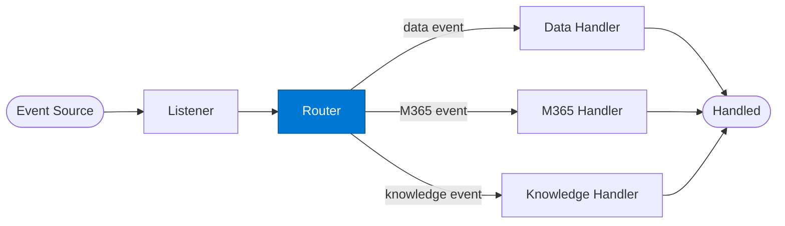

# Event Router

_Classifies the normalised event and selects the appropriate handler agent._

## Overview

The Event Router is the **router** role in the **event-driven** pattern — agents triggered by events (webhook, queue message, file upload) rather than direct calls. Enables reactive, asynchronous enterprise integrations.

## Pattern Diagram

## Contract Specification

### Inputs
**event_type** (string, required): Normalised event type from listener  
**payload** (object, required): Event payload  

### Outputs
**handler_key** (string): Key of the handler agent to invoke  
**routing_reason** (string): Why this handler was selected  

## Azure Tools

| Tool ID | Display Name | Service | Purpose in this role |
|---|---|---|---|
| `iq-foundry` | Foundry IQ | Indexed org knowledge via Azure AI Search | Classify event type to determine the correct handler |

## Use Cases

1. **Event classification**
2. **Priority routing**
3. **Multi-system event dispatch**

## Limitations

- Event deduplication must be implemented using `event_id` — Service Bus / Event Hub provides at-least-once delivery
- Handler must be idempotent

## Related Roles

- **Listener** normalises → **Router** dispatches → **Handler** processes
- See also: `checkpoint-resume` for long-running event handlers that need state persistence

---

**Status:** Production Ready  
**Version:** 1.0  
**Framework:** SAFE 1.0  
**Last Updated:** 2026-06-21
