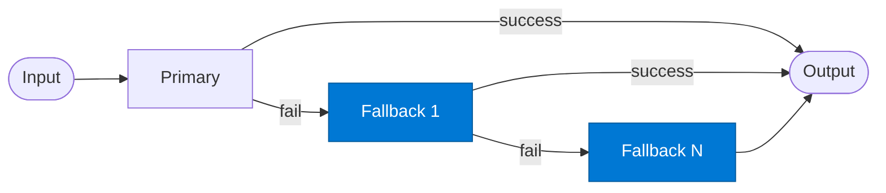

# Fallback Agent

_Provides an alternative answer when the primary agent fails or lacks sufficient confidence._

## Overview

The Fallback agent is invoked only when the primary agent fails or returns a confidence below the configured threshold. It uses alternative data sources — typically broader (Web IQ) or cached (Cosmos DB) — to produce a lower-precision but higher-availability answer. Multiple fallbacks can be chained in sequence.

## Pattern Diagram



## Contract Specification

### Inputs

**fallback_request** (object, required):
- `query` (string, required): Same query as the primary received
- `primary_failure` (object): Reason the primary failed — `{ "reason": str, "confidence": float }`
- `context` (object, optional): Forwarded from original request

### Outputs

**result** (object):
- `answer` (string, required): The fallback response
- `confidence` (float): May be lower than primary's threshold
- `source` (string): `"fallback_web"` | `"fallback_cache"` | etc.
- `caveat` (string, optional): Warning about reduced answer quality

## Azure Tools

| Tool ID | Display Name | Service | Purpose in this role |
|---|---|---|---|
| `iq-web` | Web IQ | Live public web and news via Bing grounding | First fallback — try public web when internal knowledge is insufficient |
| `azure-cosmos-db` | Azure Cosmos DB | Vector + document store; hybrid search | Second fallback — return a cached or historical result from operational DB |

## Usage

```python
from safe_framework.agents.patterns.fallback_chain.fallback import FallbackAgent

fallback = FallbackAgent(kernel=kernel, source="web")
result = await fallback.invoke({
    "query": "What is the current EU AI Act compliance deadline?",
    "primary_failure": {"reason": "low_confidence", "confidence": 0.4}
})
```

## Use Cases

1. **Web fallback** — public web search when the internal index has no answer
2. **Cache fallback** — return a recent Cosmos DB cached result when live sources are down
3. **Graceful degradation** — return a partial answer with a caveat rather than an error

## Limitations

- Fallback answers have lower authority than primary — always include `source` and `caveat` in the response
- Web IQ fallback may return outdated or incorrect public information

## Related Roles

- **Primary** — first attempt; triggers this agent on failure
- See also: `retry-loop` for retrying the same agent rather than switching to an alternative

---

**Status:** Production Ready  
**Version:** 1.0  
**Framework:** SAFE 1.0  
**Last Updated:** 2026-06-21
