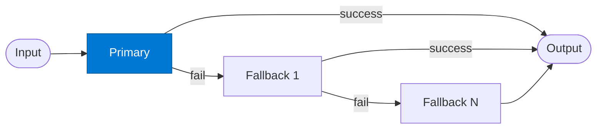

# Primary Agent

_Attempts the request using the highest-quality (and highest-cost) approach first._

## Overview

The Primary agent is the first link in the **fallback-chain**. It uses the most capable and authoritative data source available (Foundry IQ) to answer the request. On success it returns the result directly. On failure (no result, timeout, or low confidence) the route automatically tries the next link in the chain.

## Pattern Diagram



## Contract Specification

### Inputs

**request** (object, required):
- `query` (string, required): What to look up or compute
- `context` (object, optional): User and session context
- `min_confidence` (float, optional): Minimum confidence to count as a success (default: 0.7)

### Outputs

**result** (object):
- `answer` (string, required): The response
- `confidence` (float): Confidence score 0.0–1.0
- `source` (string): `"primary"`
- `sources_used` (array): References from Foundry IQ

## Azure Tools

| Tool ID | Display Name | Service | Purpose in this role |
|---|---|---|---|
| `iq-foundry` | Foundry IQ | Indexed org knowledge via Azure AI Search | Primary attempt grounded in internal org knowledge |

## Usage

```python
from safe_framework.agents.patterns.fallback_chain.primary import PrimaryAgent

primary = PrimaryAgent(kernel=kernel)
result = await primary.invoke({
    "query": "What is the approved vendor list for EMEA?",
    "min_confidence": 0.75
})
```

## Use Cases

1. **Policy lookup** — try internal policy docs first before web search
2. **High-accuracy Q&A** — authoritative internal knowledge before external fallback
3. **Cost-tiered retrieval** — expensive precise retrieval first, cheaper fallback second

## Limitations

- If Foundry IQ is unavailable, the primary will fail and trigger the fallback
- `min_confidence` threshold must be tuned per use-case — too high causes excessive fallback

## Related Roles

- **Fallback** — the next agent in the chain if this one fails or returns low confidence

---

**Status:** Production Ready  
**Version:** 1.0  
**Framework:** SAFE 1.0  
**Last Updated:** 2026-06-21
