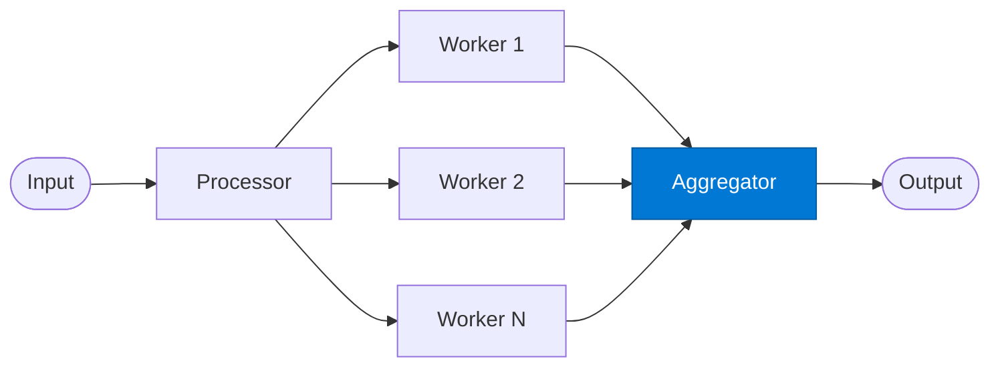

# Fan-In Aggregator

_Collects all parallel worker results and merges them into a single coherent output._

## Overview

The Aggregator is the fan-in stage. It waits for all parallel workers to complete, then merges their individual results into one consolidated response. It handles partial failures (skipped or errored items) and enriches the output with a summary of the parallel execution.

## Pattern Diagram



## Contract Specification

### Inputs

**worker_results** (array, required):
- Each element: `{ "item_id": str, "result": any, "status": str, "error_message": str? }`

### Outputs

**aggregated_result** (object):
- `results` (array): Merged results in input order
- `total` (integer): Total items processed
- `succeeded` (integer): Items with `status == "success"`
- `failed` (integer): Items with `status == "error"` or `"skipped"`
- `summary` (object): Domain-specific aggregate (e.g. counts, totals)
- `persisted_id` (string, optional): Cosmos DB document ID if persisted

## Azure Tools

| Tool ID | Display Name | Service | Purpose in this role |
|---|---|---|---|
| `iq-foundry` | Foundry IQ | Indexed org knowledge via Azure AI Search | Validate merged result against known combined-output patterns |
| `azure-cosmos-db` | Azure Cosmos DB | Vector + document store; hybrid search | Persist aggregation results for downstream audit or replay |

## Usage

```python
from safe_framework.agents.patterns.fan_out_fan_in.aggregator import FanInAggregator

agent = FanInAggregator(kernel=kernel)
final = await agent.invoke({"worker_results": results})
print(f"Succeeded: {final['succeeded']}/{final['total']}")
```

## Use Cases

1. **Result consolidation** — merge per-document analysis into a single report
2. **Voting / majority rule** — pick the most common classification across workers
3. **Data union** — combine entity lists from parallel extractions, deduplicating
4. **Audit persistence** — save all parallel results to Cosmos DB for traceability

## Limitations

- Must receive all worker results before producing output (blocking merge)
- Ordering of merged results follows input order, not completion order
- Large result sets (1000+ items) may exceed context window — consider streaming

## Related Roles

- **Processor** — fan-out stage that created the work items
- **Worker** — produced each individual result this role aggregates

---

**Status:** Production Ready  
**Version:** 1.0  
**Framework:** SAFE 1.0  
**Last Updated:** 2026-06-21
