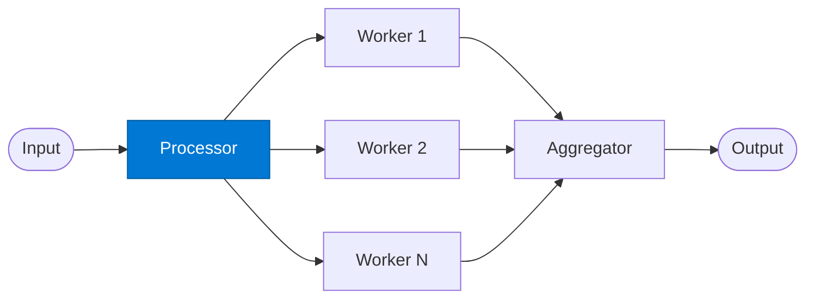

# Fan-Out Processor

_Splits the input into parallel work items and dispatches them to worker agents simultaneously._

## Overview

The Processor is the fan-out stage of the **fan-out-fan-in** pattern. It decomposes a single request into N independent work units and launches all workers in parallel. The degree of parallelism is determined at runtime — the processor adapts to the size and structure of the input.

## Pattern Diagram



## Contract Specification

### Inputs

**request** (object, required):
- `payload` (any, required): Data to be split and distributed
- `split_strategy` (string, optional): How to partition — `"even"`, `"by_type"`, `"by_size"` (default: `"even"`)
- `max_workers` (integer, optional): Cap on parallel workers (default: 10)

### Outputs

**work_items** (array):
- Each item: `{ "item_id": str, "payload": any, "worker_hint": str }`
- `total_items` (integer): Number of items dispatched

## Azure Tools

| Tool ID | Display Name | Service | Purpose in this role |
|---|---|---|---|
| `iq-foundry` | Foundry IQ | Indexed org knowledge via Azure AI Search | Ground each parallel processor in the shared knowledge base |
| `iq-fabric` | Fabric IQ | OneLake, Power BI semantic models and datasets | When processors are analysing structured business data |

## Usage

```python
from safe_framework.agents.patterns.fan_out_fan_in.processor import FanOutProcessor

agent = FanOutProcessor(kernel=kernel)
work_items = await agent.invoke({
    "payload": documents,
    "split_strategy": "by_type",
    "max_workers": 5
})
```

## Use Cases

1. **Bulk document analysis** — fan out one analysis job per document
2. **Multi-region data fetch** — dispatch one worker per region in parallel
3. **Image batch processing** — split an image batch and analyse all images simultaneously
4. **Survey aggregation** — each respondent's answers processed in parallel

## Limitations

- All workers must return before the aggregator can proceed
- Very large fan-outs (100+) may hit Semantic Kernel concurrency limits
- Split strategy must be deterministic — non-deterministic splits cause aggregation errors

## Related Roles

- **Worker** — receives each work item; executes the domain task
- **Aggregator** — merges all worker outputs
- See also: `map-reduce/splitter` for key-based partitioning

---

**Status:** Production Ready  
**Version:** 1.0  
**Framework:** SAFE 1.0  
**Last Updated:** 2026-06-21
