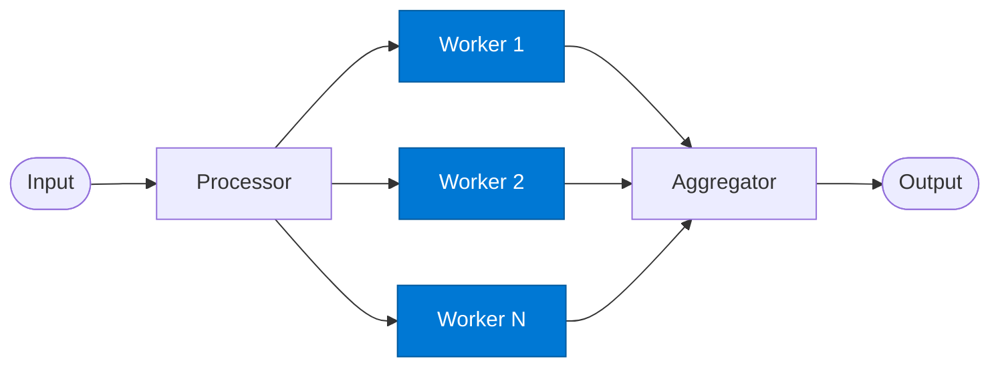

# Parallel Worker

_Executes a single work item in parallel with other worker instances._

## Overview

The Worker performs the actual domain task on one partition of the input. Multiple worker instances run concurrently — each is stateless and processes only its assigned item. Any tools (Foundry IQ, Fabric IQ) are called per-worker so each instance is independently grounded.

## Pattern Diagram



## Contract Specification

### Inputs

**work_item** (object, required):
- `item_id` (string, required): Unique identifier for this work unit
- `payload` (any, required): The data slice to process
- `worker_hint` (string, optional): Suggested processing approach

### Outputs

**worker_result** (object):
- `item_id` (string): Matches the input `item_id` for correlation
- `result` (any, required): Processed output for this item
- `status` (string): `"success"` | `"skipped"` | `"error"`
- `error_message` (string, optional): Present when `status == "error"`

## Azure Tools

| Tool ID | Display Name | Service | Purpose in this role |
|---|---|---|---|
| `iq-foundry` | Foundry IQ | Indexed org knowledge via Azure AI Search | Ground each parallel worker in the shared knowledge base |
| `iq-fabric` | Fabric IQ | OneLake, Power BI semantic models and datasets | When workers are analysing structured analytical datasets |

## Usage

```python
import asyncio
from safe_framework.agents.patterns.fan_out_fan_in.worker import ParallelWorker

agent = ParallelWorker(kernel=kernel)
results = await asyncio.gather(*[
    agent.invoke(item) for item in work_items
])
```

## Use Cases

1. **Document classification** — classify each document independently and in parallel
2. **Entity extraction** — extract entities from each record simultaneously
3. **Translation** — translate each section of a document in parallel
4. **Validation** — validate each data record against business rules concurrently

## Limitations

- Workers are stateless — do not share state between instances
- If a worker fails, the aggregator must handle `status == "error"` gracefully
- Avoid calls that modify shared state (DB writes) without distributed locking

## Related Roles

- **Processor** — fans out work items to this role
- **Aggregator** — collects all worker results
- See also: `round-robin/worker` for ordered (non-parallel) worker execution

---

**Status:** Production Ready  
**Version:** 1.0  
**Framework:** SAFE 1.0  
**Last Updated:** 2026-06-21
