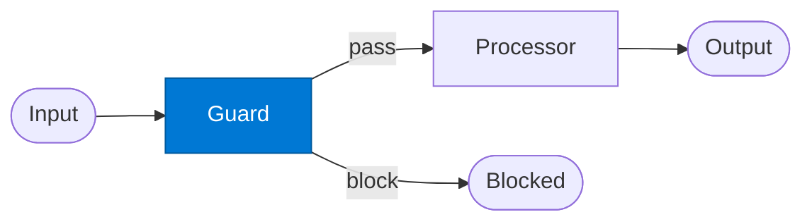

# Gate Guard

_Evaluates the request against policy rules and blocks non-compliant requests before they reach the processor._

## Overview

The Gate Guard is the **guard** role in the **gate-guard** pattern — a mandatory validation checkpoint that blocks non-compliant requests before they reach downstream processing.

## Pattern Diagram



## Contract Specification

### Inputs
**payload** (object, required): Request to evaluate  
**policy_key** (string, optional): Override policy to apply  


### Outputs
**pass** (boolean): True if request passes all guard checks  
**reason** (string): Reason for blocking (present if pass: false)  
**checks_run** (array): List of policy checks that were evaluated  


## Azure Tools

| Tool ID | Display Name | Service | Purpose in this role |
|---|---|---|---|
| `iq-foundry` | Foundry IQ | Indexed org knowledge via Azure AI Search | Policy and rule lookup for guard evaluation |
| `iq-work` | Work IQ | M365 signals — meetings, chats, emails, documents | Compliance context from org — requestor history, team policies |


## Usage

```python
from safe_framework.safe_core.code_generator import RouteCodeGenerator
from safe_framework.safe_core.models import RouteDefinition, RoutePattern, Agent

route = RouteDefinition(
    name="my-route",
    pattern=RoutePattern.GATE_GUARD,
    agents={"guard": Agent(
        name="Guard",
        category="test",
        version="1.0",
        input_schema={"type": "object", "properties": {}},
        output_schema={"type": "object", "properties": {}},
    )},
    description="Example route using this role",
)
generated = RouteCodeGenerator.generate(route)
```

## Use Cases

1. **PII scanning**
2. **Budget approval gates**
3. **Compliance pre-checks**
4. **Data quality gates**


## Limitations

- Guard policies must be kept current in Foundry IQ — stale policies allow policy violations
- A blocked request raises `ValueError`; caller must handle the exception

## Related Roles

- **Guard** is the gatekeeper; **Processor** is the downstream beneficiary
- See also: `human-in-the-loop` when the gate requires a human decision

---

**Status:** Production Ready  
**Version:** 1.0  
**Framework:** SAFE 1.0  
**Last Updated:** 2026-06-21
