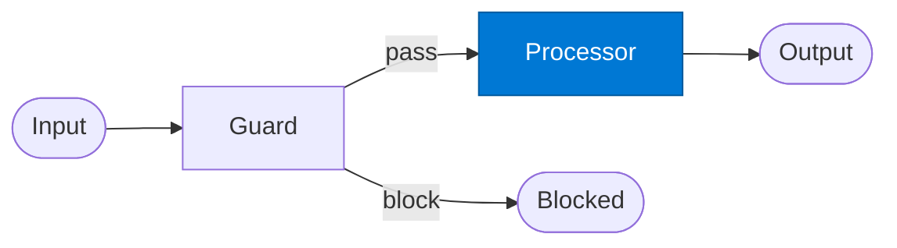

# Guarded Processor

_Performs the downstream processing after the guard approves the request._

## Overview

The Guarded Processor is the **processor** role in the **gate-guard** pattern — a mandatory validation checkpoint that blocks non-compliant requests before they reach downstream processing.

## Pattern Diagram

## Contract Specification

### Inputs
**payload** (object, required): The approved request to process  

### Outputs
**result** (object): Processing output  
**status** (string): 'success' | 'error'  

## Azure Tools

| Tool ID | Display Name | Service | Purpose in this role |
|---|---|---|---|
| `iq-foundry` | Foundry IQ | Indexed org knowledge via Azure AI Search | Process request grounded in org knowledge |
| `iq-fabric` | Fabric IQ | OneLake, Power BI semantic models and datasets | Access structured business data for processing |

## Use Cases

1. **Post-approval processing**
2. **Compliant data transformation**
3. **Validated inference**

## Limitations

- Guard policies must be kept current in Foundry IQ — stale policies allow policy violations
- A blocked request raises `ValueError`; caller must handle the exception

## Related Roles

- **Guard** is the gatekeeper; **Processor** is the downstream beneficiary
- See also: `human-in-the-loop` when the gate requires a human decision

---

**Status:** Production Ready  
**Version:** 1.0  
**Framework:** SAFE 1.0  
**Last Updated:** 2026-06-21
