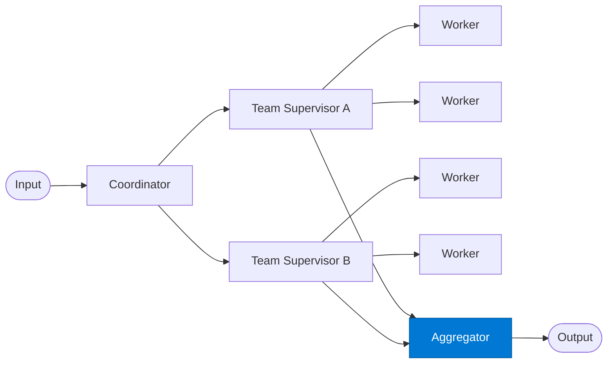

# Cross-Team Aggregator

_Merges results from all team supervisors into a unified final output._

## Overview

The Aggregator is the final stage in the **hierarchical-teams** pattern. It collects the result objects from every team supervisor, resolves any conflicts or overlaps between team contributions, and produces the single canonical output for the original task.

## Pattern Diagram



## Contract Specification

### Inputs

**team_results** (array, required):
- Each element: `{ "team": str, "result": object, "status": str, "blockers": array }`

### Outputs

**final_output** (object):
- `report` (object, required): Merged content from all teams
- `teams_contributed` (array): List of teams whose results were included
- `teams_blocked` (array): Teams that reported `"blocked"` status
- `overall_status` (string): `"complete"` | `"partial"`

## Azure Tools

| Tool ID | Display Name | Service | Purpose in this role |
|---|---|---|---|
| `iq-foundry` | Foundry IQ | Indexed org knowledge via Azure AI Search | Cross-team synthesis grounded in authoritative org knowledge |

## Usage

```python
from safe_framework.agents.patterns.hierarchical_teams.aggregator import CrossTeamAggregator

agg = CrossTeamAggregator(kernel=kernel)
output = await agg.invoke({"team_results": all_team_results})
```

## Use Cases

1. **Investor deck** — merge finance, legal, and product team contributions into one deck
2. **RFP response** — combine technical, commercial, and legal sections into a single bid
3. **Annual report** — aggregate divisional P&Ls, risk registers, and ESG summaries

## Limitations

- Aggregating contradictory team results requires LLM judgement — review outputs in high-stakes scenarios
- Blocked teams produce gaps in the output; callers should inspect `teams_blocked`

## Related Roles

- **Coordinator** — orchestrated the teams whose results this role merges
- **Team Supervisor** — each supervisor contributed one element to the input array

---

**Status:** Production Ready  
**Version:** 1.0  
**Framework:** SAFE 1.0  
**Last Updated:** 2026-06-21
