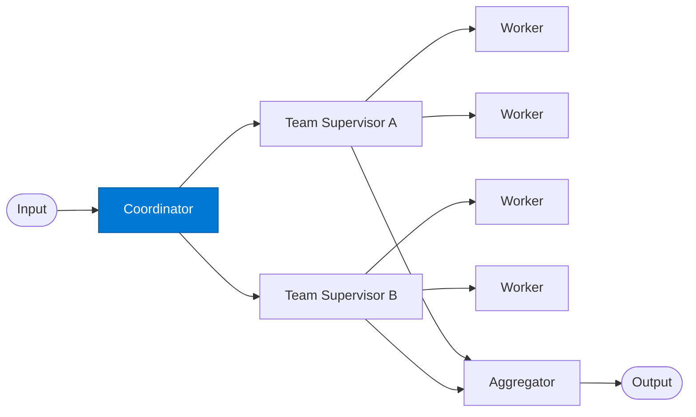

# Coordinator

_Decomposes a complex task and assigns sub-tasks to specialist teams._

## Overview

The Coordinator is the top-level orchestrator in the **hierarchical-teams** pattern. It understands the full scope of the incoming task, breaks it into team-sized sub-tasks, and assigns each sub-task to the appropriate team supervisor. The coordinator does not perform domain work itself — it focuses on planning and delegation.

## Pattern Diagram



## Contract Specification

### Inputs

**task** (object, required):
- `description` (string, required): High-level task description
- `deadline_iso` (string, optional): ISO 8601 deadline
- `priority` (string, optional): `"low"` | `"normal"` | `"high"` | `"critical"`
- `requester` (string, optional): User or team requesting the task

### Outputs

**team_assignments** (array):
- Each element: `{ "team": str, "sub_task": str, "context": object, "deadline_iso": str }`
- `coordination_plan` (object): Full decomposition plan with dependency graph

## Azure Tools

| Tool ID | Display Name | Service | Purpose in this role |
|---|---|---|---|
| `iq-work` | Work IQ | M365 signals — meetings, chats, emails, documents | Understand team structure, ownership, and past project assignments from M365 |
| `iq-foundry` | Foundry IQ | Indexed org knowledge via Azure AI Search | Retrieve org knowledge to decompose the task and assign to the right teams |

## Usage

```python
from safe_framework.agents.patterns.hierarchical_teams.coordinator import Coordinator

coord = Coordinator(kernel=kernel)
assignments = await coord.invoke({
    "description": "Prepare the Q3 investor deck",
    "deadline_iso": "2026-07-15T17:00:00Z",
    "priority": "high"
})
```

## Use Cases

1. **Cross-functional projects** — assign finance, legal, and product sub-tasks to specialist teams
2. **Due diligence** — decompose M&A analysis into risk, legal, financial, and technical workstreams
3. **Incident response** — coordinate remediation across security, engineering, and comms teams

## Limitations

- Cannot dynamically reassign tasks once dispatched — plan carefully upfront
- Relies on Work IQ team data being current; stale org charts cause misrouting
- Deep hierarchies (coordinator → team supervisor → sub-team supervisor) are supported but increase latency

## Related Roles

- **Team Supervisor** — receives sub-tasks from this coordinator
- **Aggregator** — combines team outputs after all teams complete

---

**Status:** Production Ready  
**Version:** 1.0  
**Framework:** SAFE 1.0  
**Last Updated:** 2026-06-21
